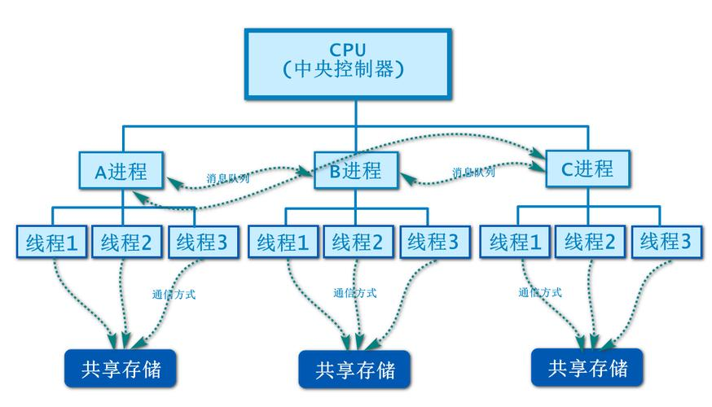
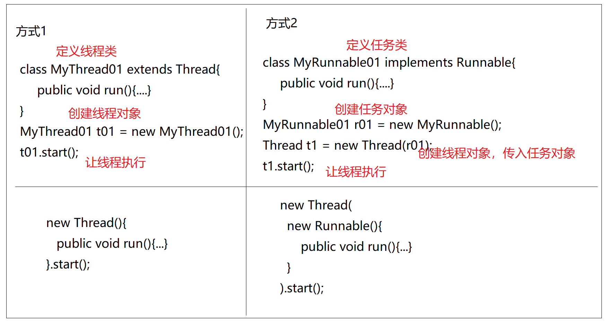
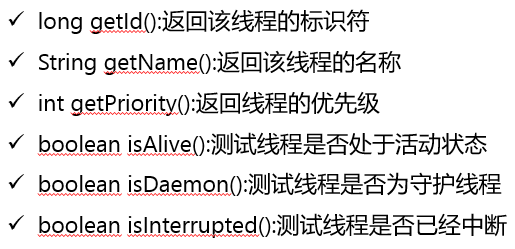
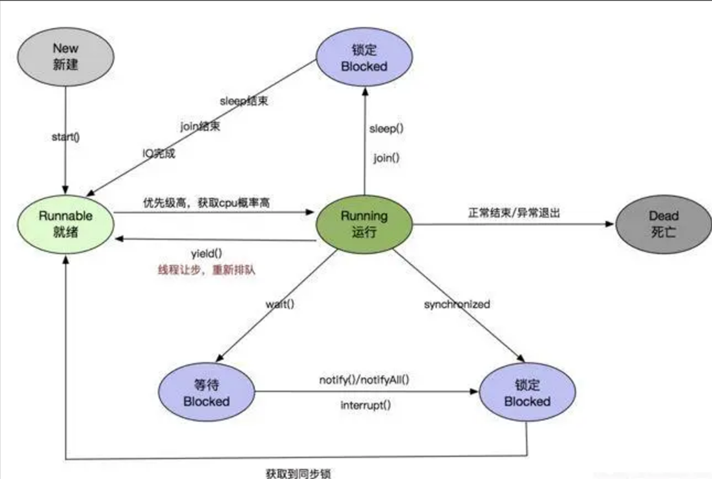

# 多线程

## 多线程基础

### 概念



#### 进程

> 操作系统中一个运行着的程序就是一个进程
>
> 操作系统可以同时运行多个程序,即多个进程,称之为多进程
>
> 多个进程之间通过抢夺CPU执行时间进行并发执行
>
> 由于CPU速度很快,切换的也很快，看起来就像在同时执行一样

#### 线程

> 一个进程里可以执行多个并行的过程,称之为线程
>
> 一个进程里可以执行多个线程称之为多线程
>
> 多个线程之间通过抢夺CPU执行时间进行并发执行
>
> 由于CPU速度很快，切换的也很快,看起来就像在同时执行一样

### 线程创建方式



#### 创建方式1：继承线程类方式

> * 写一个类继承Thread
> * 重写其中的run方法,在其中写上线程要执行的代码
> * 创建当前线程类的对象
> * 调用其start()方法即可启动一个线程

```java
public class MyThread01 extends Thread {
    private String msg;
    public MyThread01(String msg) {
        this.msg = msg;
    }

    @Override
    public void run() {
        while(true){
            System.out.println("t1 is running..."+msg);
        }
    }
}

public class MyThread02 extends Thread {
    @Override
    public void run() {
        while(true){
            System.out.println("当前时间:"+System.currentTimeMillis());
        }
    }
}
```

```java
public class Demo01 {
    public static void main(String[] args) {
        MyThread01 t01 = new MyThread01("from 01..");
        t01.start();
        MyThread01 t02 = new MyThread01("from 02..");
        t02.start();
        MyThread02 t03 = new MyThread02();
        t03.start();
        //匿名内部类方式,快速创建线程
       new Thread(){
            @Override
            public void run() {
                while (true){
                    System.out.println("print from inner Thread..");
                }
            }
        }.start();

    }
}
```

#### 创建方式2：实现任务接口方式

> - 写一个类实现Runnable接口，实现run()方法，定义出任务类
>
> *  创建任务类的对象
> *  创建线程对象，传入任务对象
> *  调用线程对象的start()方法，启动线程

```java
public class MyRunnable01 implements Runnable {
    @Override
    public void run() {
        while(true){
            System.out.println("Runnable01..print..");
        }
    }
}
public class MyRunnable02 implements Runnable {
    @Override
    public void run() {
        while(true){
            System.out.println("Runnable02..print..");
        }
    }
}
```

```java
public class Demo02 {
    public static void main(String[] args) {
        MyRunnable01 r01 = new MyRunnable01();
        Thread t1 = new Thread(r01);
        t1.start();

        MyRunnable02 r02 = new MyRunnable02();
        Thread t2 = new Thread(r02);
        t2.start();
		//匿名内部类方式
        new Thread(new Runnable(){
            @Override
            public void run() {
                while(true){
                    System.out.println("Inner Runnable print..");
                }
            }
        }).start();
    }
}
```

### 线程之间的关系

> 程序从main方法启动时，本身就是启动了一个线程称之为主线程
>
> 任意线程中都可以开启新的线程
>
> 默认情况下，线程之间都是平等的，平等的抢夺cpu执行
>
> 默认情况下，只有程序中所有的线程都结束了，程序才会结束

```Java
package thread;
/**
 * 线程之间的关系：
 * 程序从main方法启动时，本身就是启动了一个线程称之为主线程
 * 任意线程中都可以开启新的线程
 * 默认情况下，线程之间都是平等的，平等的抢夺cpu执行
 * 只有程序中所有的线程都结束了，程序才会结束
 */
public class Demo03 {
    public static void main(String[] args) {
        new Thread(new Runnable() {
            @Override
            public void run() {
                try {
                    Thread t1 = Thread.currentThread();
                    System.out.println(t1.getId()+"#"+t1.getName()+"..start...");
                    Thread.sleep(1000 * 3);
                    System.out.println(t1.getId()+"#"+t1.getName()+"..stop..");
                } catch (InterruptedException e) {
                    e.printStackTrace();
                }
            }
        }).start();

        new Thread(new Runnable() {
            @Override
            public void run() {
                try {
                    Thread t1 = Thread.currentThread();
                    System.out.println(t1.getId()+"#"+t1.getName()+"..start...");
                    Thread.sleep(1000 * 3);
                    System.out.println(t1.getId()+"#"+t1.getName()+"..stop..");
                } catch (InterruptedException e) {
                    e.printStackTrace();
                }
            }
        }).start();

        Thread tx = Thread.currentThread();
        System.out.println(tx);

        System.out.println("主线程结束了..");
    }
}
```

### 线程API

#### 概念

> 线程优先级：
>
> 线程的优先级决定了线程抢夺CPU的概率高低。优先级范围1-10，默认为5，数值越大权重越高。
>
> 守护线程：
>
> 线程分为用户线程和守护线程，线程创建出来时都为用户线程，可以将用户线程配置为守护线程。
>
> 守护线程通常都是执行用户线程的辅助任务，当程序中剩余的都是守护线程时，程序会直接结束。

#### 案例



```java
/**
 * 线程常用API：
 * Thread.currentThread()
 * Thread.sleep()
 *
 * 需要了理解,无需练习:
 * long getId():返回该线程的标识符
 * String getName():返回该线程的名称
 * void setName(String name):设置线程的名字
 * setPriority():设置线程优先级
 * int getPriority():返回线程的优先级
 * boolean isAlive():测试线程是否处于活动状态
 * void setDaemon():设置线程为守护线程
 * boolean isDaemon():测试线程是否为守护线程
 * boolean isInterrupted():测试线程是否已经中断
 */
public class Demo04 {
    public static void main(String[] args) {
        //test01();
        //test02();
        test03();
    }

    /**
     * 守护线程
     */
    public static void test03(){
        Thread t1 = new Thread(new Runnable() {
            @Override
            public void run() {
                try {
                    System.out.println("用户线程在执行..");
                    Thread.sleep(3000);
                    System.out.println("用户线程执行结束..");
                } catch (InterruptedException e) {
                    e.printStackTrace();
                }
            }
        });
        Thread t2 = new Thread(new Runnable() {
            @Override
            public void run() {
                while(true){
                    try {
                        Thread.sleep(500);
                        System.out.println("守护进程在执行..");
                    } catch (InterruptedException e) {
                        e.printStackTrace();
                    }
                }
            }
        });

        t2.setDaemon(true);

        t1.start();
        t2.start();
    }

    /**
     * 测试alive
     */
    public static void test02(){
        Thread t1 = new Thread(new Runnable() {
            @Override
            public void run() {
                try {
                    Thread t1 = Thread.currentThread();
                    System.out.println(t1.getId()+"开始运行..");
                    Thread.sleep(3000);
                    System.out.println(t1.getId()+"运行结束..");
                } catch (InterruptedException e) {
                    e.printStackTrace();
                }
            }
        });
        t1.start();

        while(true){
            System.out.println("主线程检测到t1是否存活:"+t1.isAlive());
        }

    }

    /**
     * 测试Priority
     */
    public static void test01(){
        Thread t1 = new Thread(new Runnable() {
            @Override
            public void run() {
                while(true){
                    System.out.println("t1");
                }
            }
        });
        Thread t2 = new Thread(new Runnable() {
            @Override
            public void run() {
                while(true){
                    System.out.println("t2");
                }
            }
        });

        System.out.println(t1.getPriority());
        System.out.println(t2.getPriority());

        t1.setPriority(10);
        t2.setPriority(1);

        t1.start();
        t2.start();
    }

}
```

### 案例

#### 多线程聊天室

> 一个服务器，同时接收多个客户端的连接，并与其通信
>
> 主线程负责接收连接，创建子线程负责和客户端在通信

```java
package thread;

import java.io.BufferedReader;
import java.io.IOException;
import java.io.InputStreamReader;
import java.net.InetSocketAddress;
import java.net.ServerSocket;
import java.net.Socket;

/**
 * 服务器
 */

class SocketRunnable implements Runnable{

    private Socket socket;

    public SocketRunnable(Socket socket) {
        this.socket = socket;
    }

    @Override
    public void run() {
        try {
            //1.获取输入流,转换为缓冲流
            BufferedReader reader = new BufferedReader(new InputStreamReader(socket.getInputStream()));
            //2.循环读取数据打印,如果读到exit则退出
            while(true){
                String line = reader.readLine();
                if("exit".equals(line))break;
                String host = socket.getInetAddress().getHostAddress();
                System.out.println("收到客户端["+host+"]发来的数据:"+line);
            }
            reader.close();
            socket.close();
        } catch (IOException e) {
            e.printStackTrace();
        }
    }
}

public class SimpleChatServer {
    public static void main(String[] args) {
        try {
            //1.创建ServerSocket
            ServerSocket ss = new ServerSocket();
            //2.绑定端口
            ss.bind(new InetSocketAddress(9999));
            while(true){
                //3.接收客户端连接
                Socket socket = ss.accept();
                //4.创建线程,将socket交给线程来处理
                new Thread(new SocketRunnable(socket)).start();
            }
        } catch (IOException e) {
            e.printStackTrace();
        }
    }
}

```

```java
package thread;

import java.io.PrintWriter;
import java.net.InetSocketAddress;
import java.net.Socket;
import java.util.Scanner;

public class SimpleChatClient {
    public static void main(String[] args) {
        try {
            //1.创建Socket
            Socket socket = new Socket();
            //2.连接服务器
            socket.connect(new InetSocketAddress("127.0.0.1",9999));
            System.out.println("连接服务器成功!");
            //3.获取输出流,转换为打印流
            PrintWriter printer = new PrintWriter(socket.getOutputStream());
            //4.循环从控制台读取输入,发送给服务器
            Scanner scanner = new Scanner(System.in);
            while(true){
                String line = scanner.nextLine();
                printer.println(line);
                printer.flush();
                if("exit".equals(line))break;
            }
            //5.关闭资源
            printer.close();
            socket.close();
        } catch (Exception e) {
            e.printStackTrace();
        }
    }
}
```

## 线程并发安全问题

### 概念

> 多个线程并发访问同一个共享资源,由于线程抢夺cpu的随机特性,造成对共享资源的访问产生混乱,因此造成的问题称之为多线程并发安全问题

### 案例

```java
public class Demo05 {
    private static String name = "小明";
    private static String gender = "男";

    public static void main(String[] args) {
        new Thread(new Runnable() {
            @Override
            public void run() {
                while(true){
                    if("小明".equals(name)){
                        name = "小花";
                        gender = "女";
                    }else{
                        name = "小明";
                        gender = "男";
                    }
                }
            }
        }).start();

        new Thread(new Runnable() {
            @Override
            public void run() {
                while(true){
                    System.out.println(name+"#"+gender);
                }
            }
        }).start();
    }
}
```

```java
class Bank{
    private int total = 20000;
    public boolean getMoney(int money){
        if(money<=total){
            total -= money;
            System.out.println("取现金"+money+"元");
            return true;
        }
        System.out.println("余额不足!");
        return false;
    }
}

public class Demo06 {
    private static Bank bank = new Bank();
    public static void main(String[] args) {
        //小王
        new Thread(new Runnable() {
            @Override
            public void run() {
                bank.getMoney(20000);
            }
        }).start();
        //小李
        new Thread(new Runnable() {
            @Override
            public void run() {
                bank.getMoney(20000);
            }
        }).start();
    }
}
```

### 同步机制

#### syncronized代码块

##### 基本结构

```java
syncronized(锁对象){
  要执行同步在代码
}
```

##### 原理

> 线程想要进入同步代码块,必须在锁对象上加锁
>
> 而同一个锁对象同一时间内只能有一个线程加锁成功
>
> 线程走出syncronized代码块时,释放锁
>
> 其它线程才有机会竞争到锁,进入syncronized,操作共享资源
>
> 此机制保证了同一时间内只能有一个线程操作共享资源,避免了多线程并发安全问题.

##### 锁对象的选择

> 任何对象都可以作为锁对象使用
>
> 锁对象必须是同一个对象,才能互斥
>
> 因此必须选择所有要互斥的线程都能看到的对象作为锁对象
>
> 常见的锁对象:
>
> ​	共享资源作为锁对象
>
> ​	this作为锁对象
>
> ​	类名.class作为锁对象
>
> 锁的抢夺是随机,并不保证顺序
>
> 加锁时尽量只加有风险的代码,其它代码尽量不要加进去,减少性能损耗

##### 案例

```java
public class Demo07 {
    private static String name = "小明";
    private static String gender = "男";

    public static void main(String[] args) {
        new Thread(new Runnable() {
            @Override
            public void run() {
                while(true){
                    System.out.println("其它无关代码..");
                    synchronized (Demo07.class){
                        if("小明".equals(name)){
                            name = "小花";
                            gender = "女";
                        }else{
                            name = "小明";
                            gender = "男";
                        }
                    }
                    System.out.println("其它无关代码..");
                }
            }
        }).start();

        new Thread(new Runnable() {
            @Override
            public void run() {
                while(true){
                    synchronized (Demo07.class){
                        System.out.println(name+"#"+gender);
                    }
                }
            }
        }).start();
    }
}

```

> 

#### syncronized方法

##### 基本结构

```java
public syncronized void mx(){
  ...
}
```

##### 原理

> 如果整个方法都需要保证线程安全,则可以直接在方法上声明同步
>
> 此时,任何线程想要进入这个方法,都需要先获取到锁,保证了线程安全

##### 默认锁对象

> syncronized方法的锁对象:
>
> ​	如果是普通方法,则使用this作为锁对象
>
> ​    如果是静态方法,则使用当前类.class作为锁对象

##### 案例

```java
class Bank{
    private int total = 20000;
    public synchronized boolean getMoney(int money){
        if(money<=total){
            total -= money;
            System.out.println("取现金"+money+"元");
            return true;
        }
        System.out.println("余额不足!");
        return false;
    }
}

public class Demo06 {
    private static Bank bank = new Bank();
    public static void main(String[] args) {
        //小王
        new Thread(new Runnable() {
            @Override
            public void run() {
                bank.getMoney(20000);
            }
        }).start();
        //小李
        new Thread(new Runnable() {
            @Override
            public void run() {
                bank.getMoney(20000);
            }
        }).start();
    }
}
```

### 并发安全API

#### API

有一些类在开发中使用的非常频繁,在多线程的场景下,几乎无法避免产生潜在的多线程安全问题,如果都使用Syncronized来解决,则程序中到处都是同步锁,开发困难.

为了解决这种问题,Java专门提供了一些并发安全的API,让我们不使用同步代码块也能保证这些API的线程安全.

> StringBuilder - StringBuffer
>
> ArrayList - Collections.synchronizedList(list);
>
> LinkedList - Collections.synchronizedList(list);
>
> HashSet - Collections.synchronizedSet(set);
>
> HashMap - Collections.synchronizedMap(map);

#### 案例

```java
public class Demo08 {
    public static void main(String[] args) throws InterruptedException {
        //StringBuilder sb = new StringBuilder();
        StringBuffer sb = new StringBuffer();
        new Thread(new Runnable() {
            @Override
            public void run() {
                try {
                    for(int i=0;i<1000;i++){
                        Thread.sleep(1);
                        sb.append("abc");
                    }
                } catch (InterruptedException e) {
                    e.printStackTrace();
                }
            }
        }).start();
        new Thread(new Runnable() {
            @Override
            public void run() {
                try {
                    for(int i=0;i<1000;i++){
                        Thread.sleep(1);
                        sb.append("def");
                    }
                } catch (InterruptedException e) {
                    e.printStackTrace();
                }
            }
        }).start();

        Thread.sleep(5000);
        System.out.println(sb.length());
        System.out.println(sb);
    }
}
```

```java
public class Demo09 {
    public static void main(String[] args) throws InterruptedException {
        List<Integer> lx = new ArrayList<>();
        List<Integer> list = Collections.synchronizedList(lx);
        new Thread(new Runnable() {
            @Override
            public void run() {
                try {
                    for(int i=0;i<1000;i++){
                        Thread.sleep(1);
                        list.add(i);
                    }
                } catch (InterruptedException e) {
                    e.printStackTrace();
                }
            }
        }).start();
        new Thread(new Runnable() {
            @Override
            public void run() {
                try {
                    for(int i=0;i<1000;i++){
                        Thread.sleep(1);
                        list.add(i);
                    }
                } catch (InterruptedException e) {
                    e.printStackTrace();
                }
            }
        }).start();

        Thread.sleep(5000);
        System.out.println(list.size());
    }
}
```

## 线程间的通信

### 等待唤醒机制

可以在Syncronized代码块中,在锁对象上使用如下方法控制线程的等待和唤醒

> wait() - 让当前线程进入阻塞等待状态 - 线程挂起 不再抢夺CPU 并释放锁
>
> notify() - 随机唤醒一个当前在锁对象上阻塞等待的线程 - 线程结束挂起 恢复对CPU的抢夺 但仍然需要竞争到锁才可以继续执行
>
> notifyAll() -  唤醒所有在当前锁对象上阻塞等待的线程 - 线程结束挂起 恢复对CPU的抢夺 但仍然需要竞争到锁才可以继续执行

### 入门案例

```java
public class Demo10 {
    private static String name = "小明";
    private static String gender = "男";
    public static void main(String[] args) {
        new Thread(new Runnable() {
            @Override
            public void run() {
                while (true) {
                    try {
                        synchronized (Demo10.class) {
                            if("小明".equals(name)){
                                name = "小花";
                                gender = "女";
                            } else {
                                name = "小明";
                                gender = "男";
                            }
                            Demo10.class.notify();
                            Demo10.class.wait();
                        }
                    } catch (InterruptedException e) {
                        e.printStackTrace();
                    }
                }
            }
        }).start();
        new Thread(new Runnable() {
            @Override
            public void run() {
                while(true){
                    synchronized (Demo10.class) {
                        try {
                            System.out.println(name+"#"+gender);
                            Demo10.class.notify();
                            Demo10.class.wait();
                        } catch (InterruptedException e) {
                            e.printStackTrace();
                        }
                    }
                }
            }
        }).start();
    }
}
```

```java
public class Demo11 {
    static int i = 0;
    public static void main(String[] args) {

        new Thread(new Runnable() {
            @Override
            public void run() {
                try {
                    synchronized (Demo11.class) {
                        Thread.sleep(2000);
                        System.out.println("弟弟买米回来了..");
                        i++;
                        Demo11.class.notify();
                    }
                } catch (InterruptedException e) {
                    e.printStackTrace();
                }
            }
        }).start();
        new Thread(new Runnable() {
            @Override
            public void run() {
                try {
                    synchronized (Demo11.class) {
                        Thread.sleep(3000);
                        System.out.println("姐姐买菜回来了..");
                        i++;
                        Demo11.class.notify();
                    }
                } catch (InterruptedException e) {
                    e.printStackTrace();
                }
            }
        }).start();
        new Thread(new Runnable() {
            @Override
            public void run() {
                try {
                    synchronized (Demo11.class) {
                        Thread.sleep(5000);
                        System.out.println("爸爸买锅回来了..");
                        i++;
                        Demo11.class.notify();
                    }
                } catch (InterruptedException e) {
                    e.printStackTrace();
                }
            }
        }).start();

        synchronized (Demo11.class){
            try {
               while(i<3){
                    Demo11.class.wait();
               }
                System.out.println("妈妈开始做饭了~~~");
            } catch (InterruptedException e) {
                e.printStackTrace();
            }
        }
    }
}
```

```java
public class Demo12 {
    private static int count = 0;
    public static void main(String[] args) {
        new Thread(new Runnable() {
            @Override
            public void run() {
                try {
                    Thread.sleep(2000);
                    System.out.println("安琪拉加载完成..");
                    synchronized (Demo12.class) {
                        count++;
                        if(count<3){
                            Demo12.class.wait();
                        }else{
                            Demo12.class.notifyAll();
                        }
                        System.out.println("安琪拉开始游戏..");
                    }
                } catch (InterruptedException e) {
                    e.printStackTrace();
                }
            }
        }).start();
        new Thread(new Runnable() {
            @Override
            public void run() {
                try {
                    Thread.sleep(3000);
                    System.out.println("李白加载完成..");
                    synchronized (Demo12.class) {
                        count++;
                        if(count<3){
                            Demo12.class.wait();
                        }else{
                            Demo12.class.notifyAll();
                        }
                        System.out.println("李白开始游戏..");
                    }
                } catch (InterruptedException e) {
                    e.printStackTrace();
                }
            }
        }).start();
        new Thread(new Runnable() {
            @Override
            public void run() {
                try {
                    Thread.sleep(5000);
                    System.out.println("花木兰加载完成..");
                    synchronized (Demo12.class) {
                        count++;
                        if(count<3){
                            Demo12.class.wait();
                        }else{
                            Demo12.class.notifyAll();
                        }
                        System.out.println("花木兰开始游戏..");
                    }
                } catch (InterruptedException e) {
                    e.printStackTrace();
                }
            }
        }).start();
    }
}
```


## 线程的生命周期


