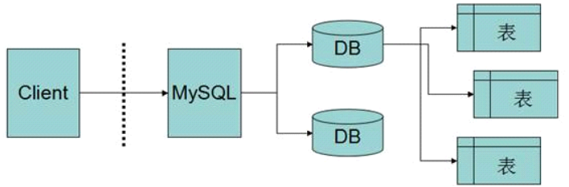

# SQL

## 基本概念

### 数据库

数据库，简而言之就是存储数据的仓库，可以按照一定的数据结构存储管理大量的数据及数据与数据之间的关系，它本质上是一种信息管理系统。

数据库根据存储采用的数据结构的不同可以分为许多种，其中常见的有层次式数据库、网络式数据库、关系型数据库。

其中关系型数据 库占据着市场的主流。

### 关系型数据库

关系型数据库是建立在关系模型基础上的数据库。

这种定义听起来十分抽象，这里我们不深入 讨论什么叫做“关系模型”--大学计算机专业专门有一门课叫“离散数学”专门讨论过关系模 型，只是简单的表述为 利用表来存储数据，用表和表之间的关系保存数据之间的关系的数据库 称为关系型数据库，这个定义不太严谨，但是更好理解。

### 常见关系型数据库

#### 商业数据库： 

> Oracle -- 甲骨文公司开发
>
> SQLServer -- 微软公司开发，.Net技术中常用 
>
> DB2 -- IBM公司开发 
>
> Sybase -- Sybase公司开发

#### 开源数据库:

> MySql -- 瑞典MySql AB研发，非常受欢迎，已经被Oracle收购 
>
> SQLite -- 小型轻量级开源关系型数据库，常用作嵌入式设备数据库

## MySQL常见概念

### 数据库服务器

指的就是一个数据库管理程序，这个程序可以管理多个数据库。

 具体来看就是在系统中运行的mysql的服务。 

该服务器根据配置监听当前机器的指定端口(默认3306)等待客户端的连接访问。

### 数据库客户端

用来连接数据库服务器进行数据库操作的程序称之为数据库客户端程序，简称数据库客户端。 

mysql自带了客户端程序，即bin/mysql.exe，可以通过该程序连接数据库服务器。

### 数据库

所谓的数据库就是在数据库服务器中创建的以一系列的表的形式存储数据的仓库。 

一个数据库服务器中可以创建多个数据库。

 多个数据库之间是互相隔离的。 

通常一个项目对应一个数据库。 

每个项目各自创建和使用各自的数据库，从而可以实现多个项目在一个数据库服务器中互不干扰的 工作。

### 表

数据库中以表来存储数据。

 一个数据库中可以创建多个表。 

通常一个javabean类对应一个表。



### 表记录

表中一条数据就是一个表记录。 

一个表中可以存储多条表记录。 

通常一个javabean对象对应一个表记录。


## SQL语言

### 概念

> SQL--Structured Query Language, 结构化查询语言,是关系型数据库通用的操作语言。 
>
> 是一种非过程性语言。
>
>  由美国国家标准局(ANSI）与国际标准化组织（ISO）制定SQL标准。
>
> 各大数据库厂商都对其做了实 现。所以我们只要学会了SQL语言，就可以操作各大关系型数据库了。 
>
> 为加强SQL的语言能力，各厂商增强了过程性语言的特征,增加了一些非标准的SQL，这样的SQL称 为该数据库的“方言”。
>
>  SQL是用来存取关系数据库的语言，具有查询、操纵、定义和控制关系型数据库的四方面功能

### 分类

•**数据定义语言（**DDL**）**: Data Definition Language

•**数据操纵语言（**DML**） **: Data Manipulation Language

•**数据查询语言（**DQL**） **：Data Query Language

•**事务控制语言（**TCL**） **：Transaction Control Language

•**数据控制语言（**DCL**） **: Data Control Language

## DDL

Data Definition Language  数据定义语言

用于建立、修改、删除数据库对象

包括:

CREATE: 创建表或其他对象结构

ALTER:修改表或其他对象结构

DROP:删除表或其他对象结构

TRUNCATE:摧毁并重建表


### 创建数据库

#### 语法

```sql
CREATE DATABASE [IF NOT EXISTS] db_name [create_specification [, create_specification] ...]
```

**IF NOT EXISTS:**

在创建前判断是否存在，如果不存在则创建，存在则不创建也不报错

**create_specification:**

CHARACTER SET charset_name #数据库默认编码集 

COLLATE collation_name #数据库默认校对规则

#### 练习

1) 创建一个名称为mydb1的数据库

   ```sql
   CREATE DATABASE mydb1;
   ```

2) 创建一个使用gbk字符集的mydb2数据库

   ```sql
   CREATE DATABASE mydb2 character set gbk;
   ```

3) 创建一个使用utf8字符集，并带校对规则utf8_bin的mydb3数据库

   ```sql
   CREATE DATABASE mydb3 character set utf8 collate utf8_bin;
   ```

### 查询数据库

#### 语法

1. 查看所有数据库

   ```sql
   show databases;
   ```

2. 查看数据库建库语句

   ```sql
   show create database db_name;
   ```

### 修改数据库

#### 语法

```sql
ALTER DATABASE [IF NOT EXISTS] db_name [alter_specification [, alter_specification] ...]
```

**IF NOT EXISTS：**

在修改前判断是否存在，如果存在则修改，如果不存在则不修改也不报错

**alter_specification:**

CHARACTER SET charset_name #修改数据库字符集编码集 

COLLATE collation_name #修改数据库校对规则

#### 练习

1. 把mydb2库的字符集修改为utf8 

   ```sql
   alter database mydb2 character set utf8;
   ```

### 删除数据库

#### 语法

```sql
DROP DATABASE [IF EXISTS] db_name
```

**IF EXISTS:** 

在删除前判断是否存在，如果存在则删除，如果不存在则不删除也不报错

#### 练习

1. 删除前面创建的mydb1数据库 	

   ```sql
   drop database mydb1;
   ```

### 切换数据库

#### 语法

```sql
use db_name;
```

### 创建表

#### 语法

```sql
CREATE TABLE table_name(
	field1 datatype [cons],
	field2 datatype [cons],
	field3 datatype [cons]
)[character set 字符集] [collate 校对规则]
field：指定列名
datatype：指定列类型
cons:约束条件
```

#### 案例

1. 创建Employee表 

   | 字段       | 属性     | 约束 |
   | ---------- | -------- | ---- |
   | id         | 整形     |      |
   | name       | 字符型   |      |
   | gender     | 字符型   |      |
   | birthday   | 日期     |      |
   | entry_date | 日期     |      |
   | job        | 字符类型 |      |
   | salary     | 浮点型   |      |
   | resume     | 大文本   |      |

   ```sql
   create table employee(
     id int,
     name varchar(255),
     gender char(1),
     birthday date,
     entry_date date,
     job varchar(255),
     salary double,
     resume text
   );
   ```


### 查看表

#### 语法

显示所有表

```sql
show tables;
```

查看表结构

```sql
desc tab_name;
```

查看建表语句

```sql
show create table tab_name;
```

### 删除表

#### 语法

```sql
drop table tab_name;
```

#### 案例

1. 删除employee表

   ```sql
   drop table employee;
   ```

### 修改表

#### 增加列

```sql
ALTER TABLE tab_name ADD (column datatype [DEFAULT expr][, column datatype]...);
```

在上面员工表的基础上增加一个image列。

```sql
alter table employee add (image blob);
```

#### 修改列

```sql
ALTER TABLE tab_name MODIFY column datatype [DEFAULT expr][, column datatype]...;
```

修改job列，使其长度为60。

```sql
alter table employee modify column job varchar(60);
```

#### 删除列

```sql
ALTER TABLE tab_name DROP (column);
```

删除gender列

```
alter table employee drop gender;
```

#### 修改表名

```sql
ALTER TABLE old_tab_name RENAME TO new_tab_name;
或
RENAME TABLE old_tab_name TO new_tab_name;
```

表名改为user

```
alter table employee rename to user;

rename table user to employee;
```

#### 修改列名

```sql
ALTER TABLE tab_name CHANGE [column] old_col_name new_col_name datatype;
```

列名name修改为username

```sql
alter table employee change column name username varchar(255);
```

#### 修改列的顺序

```sql
ALTER TABLE tab_name MODIFY col_name1 datatype AFTER col_name2;
ALTER TABLE tab_name MODIFY col_name1 datatype FIRST;
```

将image插入到username列的后面

```sql
alter table employee modify image blob after username;
```

#### 修改表的字符集

```sql
ALTER TABLE tab_name CHARACTER SET character_name;
```

修改表的字符集为gbk

```
alter table employee character set gbk;
alter table employee character set utf8;
```

## DML

Data Manipulation Language 数据库操作语言

用于改变数据库表中的数据

包括:

INSERT UPDATE DELETE

### 准备数据

```sql
create table employee(
  id int,
  name varchar(255),
  gender char(1),
  birthday date,
  entry_date date,
  job varchar(255),
  salary double,
  resume text
);
```


### 新增数据

#### 语法

```sql
INSERT INTO tab_name [(column [, column...])] VALUES (value [, value...]);
```

注意:

在values后声明的值必须和values前声明的列相匹配 

可以省略列的声明，则值按照表中列的顺序来指定值

插入的数据应与对应字段的数据类型相匹配

数据的大小应在列的规定范围内 

字符串和日期格式的数据要用单引号引起来 

不想给值的列，可以赋值为null

#### 案例

1.  向员工表中插入三条数据

   ```sql
   insert into employee (id,name,gender,birthday,entry_date,job,salary,resume) 
   values 
   (1,'刘备','m','2000-10-10','2020-11-11','卖鞋',998.00,'鞋编的好~');
   
   insert into employee 
   (id,gender,name,salary,job,resume) 
   values 
   (2,'f','关羽',888.00,'耍大刀','看家护院好管家~~');
   
   insert into employee values (3,'张飞','m','2003-03-03','2003-05-05','杀猪的',1000.00,null);
   
   insert into employee values 
   (4,'刘备2','m','2000-10-10','2020-11-11','卖鞋',998.00,'鞋编的好~'),
   (5,'刘备3','m','2000-10-10','2020-11-11','卖鞋',998.00,'鞋编的好~'),
   (6,'刘备4','m','2000-10-10','2020-11-11','卖鞋',998.00,'鞋编的好~');
   ```

### 修改数据

#### 语法

```sql
UPDATE tab_name SET col_name1=expr1 [, col_name2=expr2 ...] [WHERE where_definition]
```

UPDATE语法可以实现对表记录的修改

SET子句指定要修改哪些列，要给予哪些值

WHERE子句指定修改符合什么条件的表记录中

如没有WHERE子句，则修改所有的行

#### 案例

1. 将所有员工薪水修改为5000元

   ```sql
   update employee set salary=5000;
   ```

2. 将姓名为‘张飞’的员工薪水修改为3000元

   ```sql
   update employee set salary=3000 where name='张飞';
   ```

3. 将姓名为‘关羽’的员工薪水修改为4000元,job改为"看大院"

   ```sql
   update employee set salary=4000,job='看大院' where name='关羽';
   ```

4. 将刘备的薪水在原有基础上增加1000元。

   ```sql
   update employee set salary=salary+1000 where name='刘备';
   ```

### 删除数据

#### 语法

```sql
DELETE FROM tab_name [WHERE where_definition]
```

where用来指定要删除符合那些条件的表记录 

如果不使用where子句，将删除表中所有数据 

delete语句不能删除某一列的值（可使用update） 

delete语句仅删除记录，不删除表本身

如要删除表，使用drop table语句

也可以使用truncate来“清除数据”，本质上是摧毁后重建表

truncate相对于delete效率更高，但只能删除整表数据，无法操作单条数据

#### 案例

1. 删除表中名称为’张飞’的记录

   ```sql
   delete from employee where name = '张飞';
   ```

2. 删除表中所有记录

   ```sql
   delete from employee;
   ```

3. 使用truncate删除表中记录

   ```sql
   truncate employee;
   ```

## 约束

> 数据库中可以为字段设定额外的限定条件，要求必须符合这些条件的数据才可以被存入。
>
> 这些额外的限定条件就称之为约束。

### 主键约束

通常每张表都会有一个字段或多个字段联合起来唯一标识表记录

这样的字段称为这张表的主键字段。

基于它的作用，主键必然不可为空且不可重复。

数据库中可以为主键字段声明主键约束，一旦声明过后，数据库会帮我们维护该字段的值，非空且唯一。

如果主键字段为int类型，则可以在声明主键约束时，声明auto_increment,则该主键将具有自增特性。

```sql
primary key [auto_increment]
```

### 非空约束

如果希望某个字段的值不可以为空，则可以声明非空约束

```sql
not null
```

### 唯一约束

如果希望某个字段的值不可以重复，则可以声明唯一约束

```sql
unique
```

### 检查约束

如果希望自己指定约束条件，可以使用检查约束

```sql
check (检查的条件)
```

### 默认约束

默认情况下，字段的默认值NULL，可以通过设置默认约束指定字段的默认值

```sql
default v;
```

### 外键约束

多表设计相关的约束，后续讲解(多表查询章节)。

### 案例

创建employee2表

| 字段       | 属性     | 约束             |
| ---------- | -------- | ---------------- |
| id         | 整形     | 主键自增         |
| name       | 字符型   | 唯一             |
| gender     | 字符型   | 非空             |
| birthday   | 日期     |                  |
| entry_date | 日期     | 必须大于出生日期 |
| job        | 字符类型 | 默认值为'未知'   |
| salary     | 浮点型   |                  |
| resume     | 大文本   |                  |

```sql
create table employee22(
    id int primary key auto_increment,
    name varchar(255) unique, 
    gender char(1) not null,
    birthday date ,
    entry_date date check(entry_date>birthday),
    job varchar(255) default '未知',
    salary double,
    resume text
);
insert into employee2 values 
(null,'刘备','m','2000-03-03','2021-04-04','卖鞋',999.99,'鞋子不错~');

#insert into employee2 values 
#(null,'刘备','m','2000-03-03','2021-04-04','卖鞋',999.99,'鞋子不错~');

#insert into employee2 values 
#(3,'关羽',null,'2002-03-03','2023-04-04','卖鞋',999.99,'鞋子不错~');

#insert into employee2 values 
#(3,'关羽','f','2002-03-03','2001-04-04','刷刀',999.99,'看家护院~');

insert into employee2 values 
(3,'关羽','f','2002-03-03','2003-04-04','刷刀',999.99,'看家护院~');

insert into employee2 values 
(null,'张飞','m','2005-05-05','2006-06-06','杀猪',999.99,'杀猪小能手~');

insert into employee2 
(id,name,gender,birthday,entry_date,job,salary,resume)
values 
(null,'赵云','m','2007-05-05','2008-06-06',null,500.00,'老大的贴身保镖');

insert into employee2 
(id,name,gender,birthday,entry_date,salary,resume)
values 
(null,'赵云2','m','2007-05-05','2008-06-06',500.00,'老大的贴身保镖');
```

## DQL

DQL - Data Query Language  数据查询语言

用于查询表中的记录

包括: Select

### 准备数据

```sql
create table exam(
	id int primary key auto_increment,
    name varchar(20) not null,
    chinese double,
    math double,
    english double
);
insert into exam values (null,'关羽',85,76,70);
insert into exam values (null,'张飞',70,75,70);
insert into exam values (null,'赵云',90,65,95);
insert into exam values (null,'张三丰',82,79,null);


create table orders(
id int,
product varchar(20),
price float
);
insert into orders(id,product,price) values(1,'电视',900);
insert into orders(id,product,price) values(2,'洗衣机',100);
insert into orders(id,product,price) values(3,'洗衣粉',90);
insert into orders(id,product,price) values(4,'桔子',9);
insert into orders(id,product,price) values(5,'洗衣粉',90);

create table user (id int,name varchar(20),age int);
insert into user values (1,'aaa',19);
insert into user values (2,'bbb',23);
insert into user values (3,'ccc',32);
insert into user values (4,'ddd',18);
insert into user values (5,'eee',22);
insert into user values (6,'fff',27);
insert into user values (7,'ggg',39);
```

### 基础查询

#### 语法

```sql
SELECT [DISTINCT] *|{column1, column2. column3..} FROM tab_name;
```

select 指定查询哪些列的数据

column指定列名

*号代表查询所有列

from指定查询哪张表

DISTINCT可选，指显示结果时，是否剔除重复数据

#### 练习

1. 查询表中所有学生的信息

   ```sql
   select id,name,chiese,math,english from exam;
   select * from exam;
   ```

2. 查询表中所有学生的姓名和对应的英语成绩

   ```sql
   select name,english from exam;
   ```

3. 查询所有英语成绩并过滤重复数据

   ```sql
   select distinct english from exam;
   ```

4. 在所有学生分数上加10分特长分显示

   ```sql
   select name,math+10,chinese+10,english+10 from exam;
   ```

5. 统计每个学生的总分

   ```sql
   select name,ifnull(math,0)+ifnull(chinese,0)+ifnull(english,0)
   from exam;
   ```

6. 使用别名表示学生总分

   ```sql
   select 
   name as 姓名,
   ifnull(math,0)+ifnull(chinese,0)+ifnull(english,0) as 总分 
   from exam;
   
   select 
   name 姓名,
   ifnull(math,0)+ifnull(chinese,0)+ifnull(english,0) 总分 
   from exam;
   ```

### 条件查询

#### 语法

```sql
SELECT [DISTINCT] *|列名 FROM tab_name [WHERE where_definition]
```

其中的where关键字用于声明过滤条件:


#### 案例

1. 查询姓名为关羽的学生成绩

   ```sql
   select name,math,chinese,english from exam where name='关羽';
   ```

2. 查询英语成绩大于90分的同学

   ```sql
   select name,english from exam where english>90;
   ```

3. 查询总分大于230分的所有同学

   ```sql
   select 
   name,
   ifnull(math,0)+ifnull(chinese,0)+ifnull(english,0) as fen 
   from exam 
   where ifnull(math,0)+ifnull(chinese,0)+ifnull(english,0)  > 230;
   ```

4. 查询语文分数在 80－100之间的同学

   ```sql
   select name,chinese from exam where chinese>80 and chinese<100;
   
   select name,chinese from exam where chinese between 80 and 100;
   ```

5. 查询数学分数为75,76,77的同学，再查询分数不在这个范围内的同学

   ```sql
   select name,math from exam where math=75 or math=76 or math=77;
   select name,math from exam where math!=75 and math!=76 and math!=77;
   
   select name,math from exam where math in (75,76,77);
   select name,math from exam where math not in (75,76,77);
   ```

6. 查询所有姓张的学生成绩

   ```sql
   select * from exam where name like '张%';
   select * from exam where name like '张__';
   ```

7. 查询数学分>70，语文分>80 且英语成绩为null的同学

   ```sql
   select * from exam 
   where math>70 and chinese>80 and english is null;
   
   select * from exam 
   where math>70 and chinese>80 and english is not null;
   ```

### 排序查询

#### 语法

```sql
SELECT [DISTINCT] *|列名 FROM tab_name 
ORDER BY column_name [ASC|DESC][,column_name [ASC|DESC]];
```

ORDER BY 指定排序的列

排序的列即可以是表中的列名，也可以是select 语句后指定的别名

ASC 升序排序、DESC 降序排序，默认是ASC

#### 案例

1. 对英语成绩排序后输出

   ```sql
   select * from exam order by english desc;
   ```

2. 对总分排序按从高到低的顺序输出

   ```sql
   select 
   name,ifnull(math,0)+ifnull(chinese,0)+ifnull(english,0) as fen from exam 
   order by fen desc;
   ```

3. 对姓张的学生成绩排序输出

   ```sql
   select
   name,ifnull(math,0)+ifnull(chinese,0)+ifnull(english,0) as fen 
   from exam 
   where name like '张%'
   order by fen desc;
   ```

### 聚合函数

#### 语法

| 函数    | 作用                         |
| ------- | ---------------------------- |
| count() | 为结果集中指定的列统计行数   |
| sum()   | 为结果集中指定的列求和       |
| avg()   | 为结果集中指定的列求平均值   |
| max()   | 在结果集的指定列中寻找最大值 |
| min()   | 在结果集的指定列中寻找最小值 |

#### 案例

1. 统计一个班级共有多少学生？

   ```sql
   select count(*) from exam;
   select count(name) from exam;
   select count(1) from exam;
   ```

2. 统计数学成绩大于75的学生有多少个

   ```sql
   select count(1) from exam where math > 75;
   ```

3. 统计总分大于230的人数有多少？

   ```sql
   select count(1) from exam 
   where ifnull(math,0)+ifnull(chinese,0)+ifnull(english,0)>230;
   ```

4. 统计一个班级数学总成绩？

   ```sql
   select sum(math) from exam;
   ```

5. 统计一个班级数学、语文、英语各科的总成绩

   ```sql
   select sum(math),sum(chinese),sum(english) from exam;
   ```

6. 统计一个班级语文、英语、数学的成绩总和

   ```sql
   select sum(math) + sum(chinese)+sum(english) from exam;
   ```

7. 统计一个班级语文成绩平均分?

   ```sql
   select avg(chinese) from exam;
   ```

8. 求一个班级数学平均分？

   ```sql
   select avg(math) from exam;
   ```

9. 求一个班级总分平均分

   ```sql
   select 
   avg(ifnull(math,0)+ifnull(chinese,0)+ifnull(english,0)) as avgFen
   from exam;
   ```

10. 求班级最高分和最低分

    ```sql
    select 
    max(ifnull(math,0)+ifnull(chinese,0)+ifnull(english,0)) as maxFen,
    min(ifnull(math,0)+ifnull(chinese,0)+ifnull(english,0)) as minFen
    from exam;
    ```

### 分组查询

#### 语法

```sql
SELECT [DISTINCT] *|列名 FROM tab_name 
GROUP BY column[,comumn..] [HAVING ...]
```

分组操作可以按照指定的一个或多个列的值将数据进行分组

同一个组内的多条数据会"叠"在一起,只显示一条

其他的数据没有消失只是"压"在这条数据之下看不到 

如果没有分组操作，聚合函数作用于整个查询结果 

如果有分组操作，聚合函数作用于每个组的内部 

where和having都可以用来过滤数据 

where是分组之前过滤，having是分组之后的过滤

where中不能出现聚合函数,having中可以使用聚合函数

没有分组时，可以认为having等价于where

因为：没有分组时，having会将查询结果的每一行认成一个组,只不过这个组里只有这条数据本身，所有的过滤在组内进行时，其实就是对查询结果的每一行的过滤，因此，效果上等价于where -- 唯一的不同就是可以使用聚合函数,但

#### 案例

1. 对订单表中商品归类后，显示每一类商品的总金额

   ```sql
   select product,sum(price) from orders group by product;
   ```

2. 查询总金额大于100的商品的名称和总金额

   ```sql
   select product,sum(price)  from orders 
   group by product having sum(price)>100;
   ```

3. 查询单价小于100而总金额大于100的商品的名称.

   ```sql
   select product,sum(price) from orders 
   where price<100 
   group by product
   having sum(price) > 100;
   ```

### 分页查询

#### 语法

```sql
SELECT [DISTINCT] *|列名 FROM tab_name LIMIT n,m;
```

#### 案例

1. 从user表中，按照每次3条取数据

   ```sql
   select * from user limit 0,3;
   select * from user limit 3,3;
   select * from user limit 6,3;
   ```

2. 从user表中查询年龄最小的3个用户

   ```sql
   select * from user order by age limit 0,3;
   ```

### SQL查询编写技巧1

#### sql语句关键词的书写顺序

> select from where group by having order by limit

#### sql语句关键词的执行顺序

> from where group by having select order by limit


### SQL查询综合练习1

#### 准备数据

```sql
create database exec1;
use exec1;
create table user (id int, name varchar(20),age int, addr varchar(20));
insert into user values (1,'aa',19,'bj');
insert into user values (2,'bb',23,'sh');
insert into user values (3,'cc',26,'gz');
insert into user values (4,'dd',24,'bj');
insert into user values (5,'ee',31,'sz');
insert into user values (6,'ff',27,'sh');
insert into user values (7,'gg',26,'bj');
```

#### 案例

1. 查询年龄大于20岁的用户

   ```sql
   
   ```

2. 查询年龄在20-30岁的北京用户

   ```sql
   
   ```

3. 将20-30岁的用户按地区分组求平均年龄，求这些平均年龄大于25的地区名称。

   ```sql
   
   ```

4. 按年龄排序所有用户

   ```sql
   
   ```

5. 查询年龄大于20，年龄由小到大的前3为用户

   ```sql
   
   ```


### 子查询

#### 准备数据

```sql
create table emp2( id int, name varchar(20), salary int, did int, job varchar(20) );
insert into emp2 values (1,'aaa',3200,999,'it');
insert into emp2 values (2,'bbb',4500,888,'it');
insert into emp2 values (3,'ccc',7300,999,'saler');
insert into emp2 values (4,'ddd',3000,999,'saler');
insert into emp2 values (5,'eee',2800,777,'hr');
insert into emp2 values (6,'fff',5100,777,'it');
insert into emp2 values (7,'ggg',9100,777,'it');
insert into emp2 values (8,'hhh',9900,666,'saler');
```

#### 概念

子查询是在一条SQL语句中嵌入另一条查询语句，则该嵌入的查询语句称之为子查询语句。

#### 非关联子查询

非关联子查询中,子查询和主查询无关,子查询先于主查询执行,并将子查询的结果作为主查询的一部分使用。

##### 标量子查询

子查询是一个单行单列的结果，在主查询中作为一个值来使用。

1. 查询所有收入大于员工aaa的员工

   ```sql
   select * from emp2 where salary > (select salary from emp2 where name='aaa');
   ```

2. 查询所有部门编号及全公司平均薪水

   ```sql
   select distinct did,(select avg(salary) from emp2) from emp2;
   ```

##### 列子查询

子查询的结果是一个列多个值，在主查询中当作一个集合来使用。

1. 查询所有有it员工的部门的平均薪资

   ```sql
   select did,avg(salary) from emp2 
   where did in (select distinct did from emp2 where job='it') 
   group by did;
   ```

2. 查询所有工资高于任意it员工的saler员工

   ```sql
   select name,salary from emp2 
   where job='saler' 
   and salary > any(select salary from emp2 where job='it');
   ```

3. 查询所有工资高于全部it员工的saler员工

   ```sql
   select name,salary from emp2 
   where job='saler' 
   and salary> all(select salary from emp2 where job='it');
   ```

##### 表子查询

子查询的结果是一个表，在主查询中作为一个表来使用

1. 查询所有部门平均工资大于5000元的部门中平均工资最低的部门

   ```sql
   select did, min(asal) from (select did,avg(salary) as asal from emp2 group by did having avg(salary)>5000) as atab;
   ```

#### 关联子查询

关联子查询中，子查询中用到主查询中的列，主查寻先于子查询执行，之后将主查寻的结果应用于子查询进行过滤。

通常会配合exists来使用。

1. 查询工资大于销售平均工资的it员工的姓名（此题也可以用非关联子查询中标量子查询实现）

   ```sql
   select name from emp2 
   where job='it' 
   and salary>(select avg(salary) from emp2 where job='saler');
   
   select name,salary from emp2 as otab where job='it' and exists (select * from emp2 as itab where job='saler' having otab.salary > avg(itab.salary));
   ```

### SQL查询编写技巧2

#### 子查询的处理

如果遇到子查询需求，先考虑使用非关联子查询，非关联子查询处理不了的再考虑关联子查询。

非关联子查询，先写主查寻，遇到需要进一步获取的内容时，先空着，写好主查寻的结构后，再写子查询，将子查询的结果用作一个值、列、表应用在主查寻中，填入空出的位置。

关联子查询，先写主查寻，再将主查寻的结果理解为一张表，再编写子查询的语句，对主查寻中的每条数据进行过滤。

### 多表查询

#### 外键约束

##### 概念

关系型数据库可以保存数据和数据之间的关系。 

数据以表记录的形式保存。

数据之间的关系以表和表之间的关系的形式保存。 

表和表之间的关系通过外键字段来维系，通过外键约束来约束。 

一旦任何操作违背的外键约束，数据库会报错，阻止该操作的执行，防止出现数据无法对应的情况。


##### 定义

1. 建表时指定外键约束

   ```sql
   [CONSTRAINT <外键名>] FOREIGN KEY (字段名 [，字段名2，…]) REFERENCES <主表名> (主键列1 [，主键列2，…])
   [on delete restrict/CASCADE] [on update restrict/CASCADE];
   
   *RESTRICT : 只要本表格里面有指向主表的数据， 在主表里面就无法删除/修改相关记录。
   *CASCADE : 如果在foreign key 所指向的那个表里面删除/修改一条记录，那么在此表里面的跟那个key一样的所有记录都会一同删掉/修改。
   
   ```

   ```sql
   create table dept(
       id varchar(10) primary key,
   	name varchar(20)
   );
   insert into dept values ('001','人事部');
   insert into dept values ('002','财务部');
   insert into dept values ('003','行政部');
   insert into dept values ('004','销售部');
   
   create table emp(
     id varchar(10) primary key,
     name varchar(20),
     did varchar(10),
     foreign key (did) references dept(id)
   );
   insert into emp values ('999','孙悟空','001');
   insert into emp values ('888','哈利波特','001');
   insert into emp values ('777','萨达姆','002');
   insert into emp values ('666','特朗普','003');
   insert into emp values ('555','朴乾','004');
   
   update emp set did='005' where name='哈利波特';
   delete from dept where id = '001';
   ```

2. 对已有的表增加外键约束

   ```sql
   ALTER TABLE tab_name ADD [CONSTRAINT fk_name] FOREIGN KEY(字段名) REFERENCES 表名(字段名) [on delete restrict] [on update restrict];
   *RESTRICT: 只要本表格里面有指向主表的数据， 在主表里面就无法删除/修改相关记录。
   *CASCADE: 如果在foreign key 所指向的那个表里面删除/修改一条记录，那么在此表里面的跟那个key一样的所有记录都会一同删掉/修改。
   ```

   ```sql
   create table deptx(
       id varchar(10) primary key,
   	name varchar(20)
   );
   insert into deptx values ('001','人事部');
   insert into deptx values ('002','财务部');
   insert into deptx values ('003','行政部');
   insert into deptx values ('004','销售部');
   
   create table empx(
     id varchar(10) primary key,
     name varchar(20),
     did varchar(10)
   );
   insert into empx values ('999','孙悟空','001');
   insert into empx values ('888','哈利波特','001');
   insert into empx values ('777','萨达姆','002');
   insert into empx values ('666','特朗普','003');
   insert into empx values ('555','朴乾','004');
   
   alter table empx add foreign key (did) references deptx(id);
   ```

3. 删除外键

   ```sql
   ALTER TABLE tab_name DROP FOREIGN KEY fk_name;
   ```

   ```sql
   show create table empx;
   alter table empx drop foreign key empx_ibfk_1;
   ```

#### 多表设计

数据库通过表来存储数据，通过表和表之间的关系来存储数据之间的关系。 

通过外键字段来维系表和表之间的关系。 

而根据表和表之间关系的不同，外键字段设置的方式不同

##### 1对1

对于一对一的关系，可以在任意一边设计外键保存另一方的主键，维系两张表的关系。


##### 1对多

对于一对多的关系，需要在多的一方设计外键保存另一方的主键，维系两张表的关系。


##### 多对多

对于多对多的关系，需要设计第三方关系表保存两张表之间的对应关系。

相当于将一个多对多拆分为两个一对多来进行存储。


#### 多表查询

关系型数据库通过表来存储数据，通过表和表之间的关系存储数据之间的关系。 

表和表之间通过外键字段维系关系。 

此时，查询操作可能会跨着多张表进行，即多表查询。

##### 准备数据

```sql
create table dept3(
    id int primary key auto_increment,
	name varchar(20)
);
insert into dept3 values (null,'财务部');
insert into dept3 values (null,'人事部');
insert into dept3 values (null,'科技部');
insert into dept3 values (null,'销售部');

create table emp3(
    id int primary key auto_increment,
	name varchar(20),
	did int
);
insert into emp3 values (null,'刘备',1);
insert into emp3 values (null,'关羽',2);
insert into emp3 values (null,'张飞',3);
insert into emp3 values (null,'赵云',5);
```

##### 笛卡尔积查询

尝试直接查询两张表

```sql
select * from dept3,emp3;
```

得到的是两张表的相乘的结果，称之为笛卡尔积查询。

如果左边表有m条数据，右边表有n条数据,则得到m*n条数据。

笛卡尔积查询没有考虑两张表中数据的对应关系,所以得到的结果中包含着大量错误的数据,通常无法直接使用。

虽然通常无法直接使用,但笛卡尔积查询是其他查询方式的基础,需要了解。


##### 内连接查询

在笛卡尔积查询的基础上,基于外键字段筛选出正确的数据

```sql
select * from dept3,emp3 where emp3.did = dept3.id;
```


这样的查询被称为内连接查询

内连接查询也可以通过专用的语法来实现

```sql
select * from dept3 inner join emp3 on emp3.did = dept3.id;
```


内连接查询只能查找到两张表中都有对应数据的记录。

对于左边表有而右边表没有 和 右边表有而左边表没有的记录 都不会被查询出来。

##### 外连接查询

###### 左外连接查询

在内连接的基础上,增加左边表有而右边表没有的数据

```sql
select * from dept3 left join emp3 on emp3.did = dept3.id;
```


###### 右外连接查询

在内连接的基础上,增加右边表有而左边表没有的数据

```sql
select * from dept3 right join emp3 on emp3.did = dept3.id;
```


###### 全外连接查询

在内连接的基础上,增加左边表有而右边表没有的数据  和  右边表有而左边表没有的数据

```sql
select * from dept3 full join emp3 on emp3.did = dept3.id;
```

注意，mysql不支持全外连接！以上语句无法在mysql中执行。

可以通过union操作，合并左外连接和右外连接，模拟得到全外连接的结果。

```sql
select * from dept3 left join emp3 on emp3.did = dept3.id
union
select * from dept3 right join emp3 on emp3.did = dept3.id;
```


### SQL查询编写技巧3

#### 多表查询的处理

先关联两张表，再将关联结果理解为一张虚拟的表，去关联第三张表

关联时,根据是如何处理单边数据选择不同的关联方式

如此，依次关联所有的表

最终将所有关联在一起的表理解为一张表正常写sql即可

当多个关联表中存在重名的列,引用要通过表名.列名来明确指定引用的是哪个列

### SQL查询综合练习2

#### 准备数据

```sql
create database exec2;
use exec2;

create table user (id int,name varchar(20));
insert into user values(1,'aaa');
insert into user values(2,'bbb');
		
create table orders (id int ,money double,uid int);
insert into orders values (123,13.0,1);
insert into orders values (789,17.0,1);
insert into orders values (999,13.5,2);
		
create table prod(id int,name varchar(20),price double);
insert into prod values (99,'大大泡泡糖',5.0);
insert into prod values (88,'可口可乐',3.0);
insert into prod values (77,'统一冰红茶',4.5);
		
create table order_prod(oid int,pid int,num int);
insert into order_prod values (123,99,2);
insert into order_prod values (123,88,1);
insert into order_prod values (789,99,1);
insert into order_prod values (789,88,1);
insert into order_prod values (789,77,2);
insert into order_prod values (999,77,3);
```

1. 查询所有商品销量榜前两名,要求结果集中包含 商品id、销售总量

   ```sql
   select pid,sum(num) as sn 
   from order_prod
   group by pid 
   order by sn desc 
   limit 0,2;
   ```

2. 查询销量最大的商品的名称

   ```sql
   select prod.name
   from prod inner join order_prod on order_prod.pid = prod.id
   group by prod.name
   order by sum(order_prod.num) desc
   limit 0,1;
   ```

3. 查询销售额最高的商品的名称

   ```sql
   select
     prod.name
   from
     prod inner join order_prod on prod.id = order_prod.pid
   group by 
     prod.name
   order by
     prod.price * sum(order_prod.num) desc
   limit
     0,1;
   ```

4. 下单次数最多的用户的名字，结果集中包含：用户编号，用户名，下单次数

   ```sql
   select
     user.id,user.name,count(1) as sc
   from
     user inner join orders on orders.uid = user.id
   group by
     user.name
   order by
     sc desc
   limit
     0,1
   ```

5. 查询每个人购买的商品的名称及数量

   ```sql
   select
   	user.id,user.name,prod.id,prod.name,sum(order_prod.num) as sc
   from
   	user inner join orders on orders.uid = user.id
   	inner join order_prod on order_prod.oid = orders.id
   	inner join prod on order_prod.pid = prod.id
   group by
   	prod.id,user.id
   ```

6. 求总消费金额最高的人的人名(要求：不使用orders表中的money字段实现)

   ```sql
   select
   	user.name,sum(prod.price * order_prod.num) tm
   from
       user inner join orders on orders.uid = user.id
       inner join order_prod on order_prod.oid = orders.id
       inner join prod on order_prod.pid = prod.id
   group by
   	user.id
   order by
   	tm desc
   limit
   	0,1
   ```

7. 查询单笔订单金额最高的订单所属的用户名(要求：不使用orders表中的money字段实现)

   ```sql
   select
   	user.name,orders.id,sum(prod.price*order_prod.num) as sn
   from
   	user inner join orders on orders.uid = user.id
   	inner join order_prod on order_prod.oid = orders.id
   	inner join prod on order_prod.pid = prod.id
   group by
   	orders.id
   order by
   	sn desc
   limit
   	0,1;
   ```

8. 查询所有商品和最畅销商品的销售数量的差距

   ```sql
   select
     order_prod.pid,sum(order_prod.num) - (
     	select
           sum(order_prod.num) as sn
       from 
           order_prod
       group by
           order_prod.pid
       order by 
           sn desc
       limit
           0,1
     ) as dn
   from
     order_prod
   group by
     order_prod.pid
   order by dn 
   	desc;
   ```

9. 消费额最大的用户和消费额最小的用户的消费额的差(要求：允许使用orders表中的money字段实现)

   ```sql
   select
   	sum(money) - (
       	select
               sum(money)
           from
               orders
           group by
               uid
           order by
               sum(money) asc
           limit
               0,1
       ) as diff
   from
   	orders
   group by
   	uid
   order by
   	sum(money) desc
   limit
   	0,1;
   ```

10. aaa用户对统一冰红茶销量的贡献比

    ```sql
    select
    	(sum(num) / (
            select
                sum(num)
            from
                order_prod inner join prod on order_prod.pid = prod.id
            where
                prod.name='统一冰红茶'
        )) as rate
    from
    	user inner join orders on orders.uid = user.id
    	inner join order_prod on order_prod.oid = orders.id
    	inner join prod on order_prod.pid = prod.id
    where 
    	user.name='aaa' and prod.name='统一冰红茶'
    ```

11. 求购买过滞销商品(总销量小于等于3)的用户

    ```sql
    select
    	distinct user.name
    from
    	user inner join orders on orders.uid = user.id
    	inner join order_prod on order_prod.oid = orders.id
    where 
    	order_prod.pid in (select pid from order_prod group by pid having sum(num) <=3);
    ```

12. 求购买最畅销商品最多的人的名称

    ```sql
    select
    	user.id,user.name,order_prod.pid,sum(order_prod.num) as sn
    from
    	user inner join orders on orders.uid = user.id
    	inner join order_prod on order_prod.oid = orders.id
    where
    	order_prod.pid = (
        	select
                pid
            from
                order_prod
            group by
                pid
            order by
                sum(num) desc
            limit
                0,1
        )
    group by
    	user.id
    order by 
    	sn desc
    limit
    	0,1;
    ```

### SQL查询综合练习3

#### 准备数据

```sql
create database exec3;			-- 创建db10数据库
use exec3;						-- 切换到db10数据库
create table dept(				-- 创建部门表
	deptno int primary key,		-- 部门编号
	deptname varchar(50),		-- 部门名称
	loc varchar(50)				-- 部门位置
);
INSERT INTO `dept` VALUES ('10', '会计部', '北京');
INSERT INTO `dept` VALUES ('20', '调查部', '杭州');
INSERT INTO `dept` VALUES ('30', '销售部', '上海');
INSERT INTO `dept` VALUES ('40', '营销部', '深圳');

create table emp(				-- 创建员工表
	empno int primary key,		-- 员工编号
	empname varchar(50),		-- 员工姓名
	job varchar(50),			-- 职位
	mgr int,					-- 直属上级
	hiredate date,				-- 受雇日期
	sal int,					-- 薪资
	comm int,					-- 奖金
	deptno int,					-- 所在部门编号
	foreign key(deptno) references dept(deptno)
);
INSERT INTO `emp` VALUES ('7369', '张无忌', '办事员', '7902', '1980-12-17', '800', null, '20');
INSERT INTO `emp` VALUES ('7499', '曹操', '推销员', '7698', '1981-02-20', '1600', '300', '30');
INSERT INTO `emp` VALUES ('7521', '杨志', '推销员', '7698', '1981-02-22', '1250', '500', '30');
INSERT INTO `emp` VALUES ('7566', '朱元璋', '经理', '7839', '1981-04-02', '2975', null, '20');
INSERT INTO `emp` VALUES ('7654', '殷天正', '推销员', '7698', '1981-09-28', '1250', '1400', '30');
INSERT INTO `emp` VALUES ('7698', '张三丰', '经理', '7839', '1981-05-01', '2850', null, '30');
INSERT INTO `emp` VALUES ('7782', '关羽', '经理', '7839', '1981-06-09', '2450', null, '10');
INSERT INTO `emp` VALUES ('7788', '宋江', '分析员', '7566', '1987-04-19', '3000', null, '20');
INSERT INTO `emp` VALUES ('7839', '韩少云', '董事长', null, '1981-11-17', '5000', null, '10');
INSERT INTO `emp` VALUES ('7844', '孙二娘', '推销员', '7698', '1981-09-08', '1500', '0', '30');
INSERT INTO `emp` VALUES ('7876', '张飞', '办事员', '7788', '1987-05-23', '1100', null, '20');
INSERT INTO `emp` VALUES ('7900', '赵云', '办事员', '7698', '1981-12-03', '950', null, '30');
INSERT INTO `emp` VALUES ('7902', '诸葛亮', '分析员', '7566', '1981-12-03', '3000', null, '20');
INSERT INTO `emp` VALUES ('7934', '夏侯惇', '办事员', '7782', '1982-01-23', '1300', null, '10');
```

1. 查询所有部门名称和部门中所有员工的信息，注意，有些部门没有任何员工也要被列出来。

```

```


### SQL查询综合练习4

牛客网：https://www.nowcoder.com/exam/oj?tab=SQL%E7%AF%87&topicId=82

