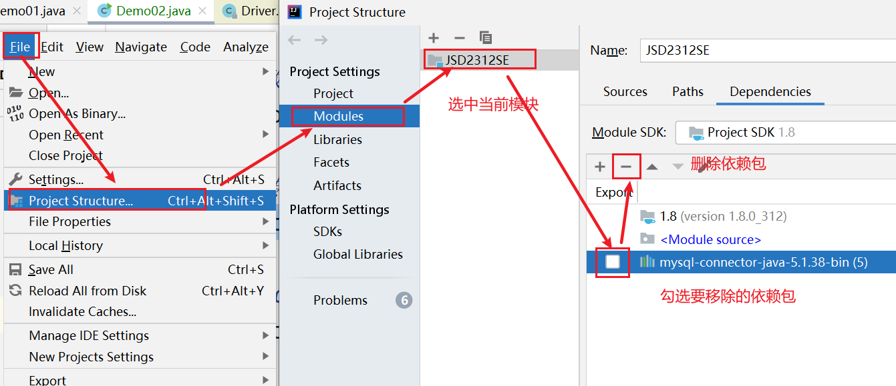
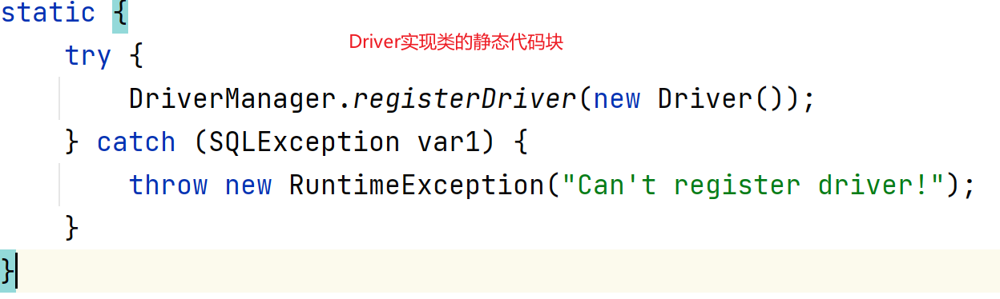

# JDBC

## 概念

### 数据库驱动

数据库厂商提供的用来操作数据库的jar包就叫做数据库的驱动，不同的厂商提供的驱动包不通用。

### JDBC

JDBC（Java DataBase Connectivity）就是Java数据库连接，是SUN公司提供的连接和操作数据库的技术。

说白了就是用Java语言来操作数据库的技术。

由于不同的数据库厂商提供的数据库驱动各不相同,在使用不同数据库时需要学习对应数据库驱动的api，对于开发人员来说学习成本十分的高。

于是sun提供了JDBC的规范，本质上一大堆的接口，要求不同的数据库厂商提供的驱动都实现这套接口，这样一来开发人员只需要学会JDBC这套接口，所有的数据库驱动作为这套接口的实现，就都会使用了。大大降低了学习成本。

### JDBC包

JDBC主要是由 java.sql 和javax.sql包组成的,并且这两个包已经被集成到J2SE的规范中了,这意味着,只要一个普通的java程序就可以使用JDBC。

要注意的是,在开发数据库程序时,除了如上的两个包,还需要手动的导入具体的数据库驱动。


## 入门案例

### 准备数据

```java
create database day16;
use day16;
create table user(id int,name varchar(255),age int);
insert into user values (1,'aaa',18);
insert into user values (2,'bbb',22);
insert into user values (3,'ccc',31);
```

### 导入驱动包

> MySQL5 MariaDB 导入 [mysql-connector-java-5.1.38-bin.jar]
>
> MySQL8 导入[mysql-connector-j-8.3.0.jar]


### 移除依赖包

> 如果需要移除导入的依赖包，可以按照此方法操作



### 代码实现

```java
public static void main(String[] args) throws SQLException {
        //1.注册数据库驱动
        DriverManager.registerDriver(new Driver());
        //2.获取数据库连接
        Connection conn = DriverManager.getConnection("jdbc:mysql://localhost:3306/day16", "root", "root");
        //3.获取传输器
        Statement stat = conn.createStatement();
        //4.传输sql执行获取结果集
        ResultSet rs = stat.executeQuery("select * from user");
        //5.处理结果
        while(rs.next()){
            int id = rs.getInt("id");
            String name = rs.getString("name");
            int age = rs.getInt("age");
            System.out.println(id+"#"+name+"#"+age);
        }
        //6.关闭资源
        rs.close();
        stat.close();
        conn.close();
    }
```

## API详解

### 注册数据库驱动

#### 传统方式

```java
DriverManager.registerDriver(new Driver());
```

使用这种方式注册数据库驱动有两个缺点:

1. mysql的中Driver接口的实现类的静态代码块本身就会注册驱动，所以这种方式会造成驱动被注册两次。
2. 这种方式导致了程序和具体的数据库驱动绑死在了一起，切换驱动时需要重新导包,程序的灵活性比较低。

不推荐使用

#### 推荐方式

```java
Class.forName("com.mysql.jdbc.Driver"); //MySQL5 MariaDB
Class.forName("com.mysql.cj.jdbc.Driver");//MySQL8
```

1. 这种方式,通过类加载,保证驱动类的静态代码块一定会被执行,触发驱动类中静态代码块中的驱动注册,避免了重复注册

   

2. 这种方式通过字符串配置驱动类,可以提取到配置文件中,防止程序和驱动包绑定死

### 获取数据库连接

#### 数据库URL

数据库的URL用于标识数据库的位置信息，不同的数据库地址写法不同，其作用包括

1. 告知程序要连接的数据库的位置、连接参数、用户名、密码等信息
2. 使程序知道要连接的是哪种数据库，用哪个驱动包

| 数据库    | 地址写法                                                     | 示例                                                         |
| --------- | ------------------------------------------------------------ | ------------------------------------------------------------ |
| mysql5    | **jdbc:mysql://地址:端口/库名?参数1=值1&参数2=值2&..**       | jdbct:mysql://localhost:3306/day16<br />jdbct:mysql://localhost/day16<br />jdbc:mysql:///day16 |
| mysql8    | **jdbc:mysql://地址:端口/库名?参数1=值1&参数2=值2&..**       | jdbct:mysql://localhost:3306/day16?serverTimezone=UTC        |
| orace     | **jdbc:oracle:thin:@主机名:端口号:实例名**                   | jdbc:oracle:thin:@localhost:1521:sid                         |
| sqlServer | **jdbc:microsoft:sqlserver://主机名:端口号;DatabaseName=库名** | jdbc:microsoft:sqlserver://localhost:1433;DatabaseName=sid   |

### Connection对象

#### 概述

Connection代表数据库的链接，是数据库编程中最重要的一个对象

客户端与数据库所有交互都是通过connection对象完成的

#### API

```java
createStatement()//创建向数据库发送sql的statement对象。
prepareStatement(sql)//创建向数据库发送预编译sql的PreparedSatement对象。
setAutoCommit(boolean autoCommit)//设置事务是否自动提交。 
commit()//在链接上提交事务。
rollback()//在此链接上回滚事务。
```

### Statement对象

#### 概述

Statement对象用于向数据库发送SQL语句，并获取执行结果

#### API

```java
ResultSet executeQuery(String sql) //用于向数据库发送查询语句。
int executeUpdate(String sql) //用于向数据库发送insert、update或delete语句
boolean execute(String sql) //用于向数据库发送任意sql语句
addBatch(String sql) //把多条sql语句放到一个批处理中。
executeBatch() //向数据库发送一批sql语句执行。 
```

### ResultSet对象

#### 概述

ResultSet对象代表SQL查询结果。

其中以表的形式封装了查询结果数据。

#### API

```java
boolean next() //移动到下一行,如果成功指向了一条新的数据返回true，否则返回false
boolean Previous() //移动到前一行,如果成功指向了一条数据返回true，否则返回false
boolean absolute(int row) //移动到指定行,如果成功指向了一条数据返回true，否则返回false
void beforeFirst()//移动resultSet的第一行的前面
void afterLast() //移动到resultSet的最后一行的后面
```

```java
String getString(int index)
String getString(String columnName)
int getInt(columnIndex)
int getInt(columnLabel)
double getDouble(columnIndex)
double getDouble(columnLabel)
...
Object getObject(int index)
Object getObject(string columnName)
```

### 释放资源

#### 概述

JDBC相关的对象使用之后都要释放。

Connection对象占用数据库连接，而数据连接非常有限且宝贵，使用过后要尽快释放。

Statement对象、ResultSet对象中封装着SQL语句、执行结果数据，占用内存资源，用过后也应尽快释放。

释放顺序：越晚获取的对象越先关闭。

#### 示例

##### 标准写法

```java
Connection conn = null;
Statement stat = null;
ResultSet rs = null;
try {
    ...
} catch (Exception e) {
    e.printStackTrace();
    throw new RuntimeException(e);
} finally {
    try {
        if (rs!=null) {
            rs.close();
        }
    } catch (SQLException e) {
        e.printStackTrace();
        throw new RuntimeException(e);
    } finally {
        rs = null;
        try {
            if (stat != null) {
                stat.close();
            }
        } catch (SQLException e) {
            e.printStackTrace();
            throw new RuntimeException(e);
        } finally {
            stat = null;
            try {
                if (conn != null) {
                    conn.close();
                }
            } catch (SQLException e) {
                e.printStackTrace();
                throw new RuntimeException(e);
            } finally {
                conn = null;
            }
        }
    }
}
```

##### 简略写法

```java
Connection conn = null;
Statement stat = null;
ResultSet rs = null;
try {
    ...
} catch (Exception e) {
    e.printStackTrace();
    throw new RuntimeException(e);
} finally {
    if (rs!=null) {
        try {
            rs.close();
        } catch (SQLException e) {
            e.printStackTrace();
        } finally {
            rs = null;
        }
    }
    if (stat!=null) {
        try {
            stat.close();
        } catch (SQLException e) {
            e.printStackTrace();
        } finally {
            stat = null;
        }
    }
    if (conn!=null) {
        try {
            conn.close();
        } catch (SQLException e) {
            e.printStackTrace();
        } finally {
            conn = null;
        }
    }
}
```

## JDBC实现CRUD

### 示例

```java
/**
 * JDBC 的 CRUD
 */
public class Demo03 {
    private Connection conn = null;
    private Statement stat = null;
    private ResultSet rs = null;

    @Before
    public void before(){
        try {
            //1.注册数据库驱动
            Class.forName("com.mysql.jdbc.Driver");
            //2.获取数据库连接
            conn = DriverManager.getConnection("jdbc:mysql:///day16","root","root");
            //3.获取传输器
            stat = conn.createStatement();
        } catch (Exception e) {
            e.printStackTrace();
            throw new RuntimeException(e);
        }
    }

    @After
    public void after(){
        //6.关闭资源
        if(rs!=null){
            try {
                rs.close();
            } catch (SQLException e) {
                e.printStackTrace();
            } finally {
                rs = null;
            }
        }
        if(stat!=null){
            try {
                stat.close();
            } catch (SQLException e) {
                e.printStackTrace();
            } finally {
                stat = null;
            }
        }
        if(conn!=null){
            try {
                conn.close();
            } catch (SQLException e) {
                e.printStackTrace();
            } finally {
                stat = null;
            }
        }
    }

    /**
     * 查询
     */
    @Test
    public void query(){
        try {
            //1.传输sql执行,获取结果
            rs = stat.executeQuery("select * from user where id <=2");
            //2.处理结果
            while(rs.next()){
                String name = rs.getString("name");
                System.out.println(name);
            }
        } catch (SQLException e) {
            e.printStackTrace();
            throw new RuntimeException(e);
        }
    }

    /**
     * 删除
     */
    @Test
    public void delete(){
        try {
            //1.传输sql执行,获取结果
            int i = stat.executeUpdate("delete from user where id = 4");
            //2.处理就结果
            if(i<=0){
                System.out.println("删除失败!");
            }else{
                System.out.println("删除成功!影响的行数为:"+i);
            }
        } catch (SQLException e) {
            e.printStackTrace();
            throw new RuntimeException(e);
        }
    }

    /**
     * 修改
     */
    @Test
    public void update() {
        try {
            //1.传输sql执行,获取结果
            int i = stat.executeUpdate("update user set age=88 where id=4");
            //2.处理结果
            if(i<=0){
                System.out.println("执行失败!");
            }else{
                System.out.println("修改数据成功!影响到的行数为"+i);
            }
        } catch (Exception e) {
            e.printStackTrace();
            throw new RuntimeException(e);
        }
    }

    /**
     * 新增
     */
    @Test
    public void insert(){
        try {
            //1.传输sql执行获取结果集
            int i = stat.executeUpdate("insert into user values (4,'ddd',33)");
            //2.处理结果
            if(i<=0){
                System.out.println("插入失败!");
            }else{
                System.out.println("插入成功，影响到的行数为"+i);
            }
        } catch (Exception e) {
            e.printStackTrace();
            throw new RuntimeException(e);
        }
    }
}
```

## SQL注入攻击

### 演示

> 发现无需输入密码，直接登录，发现无需密码登录了进去。
>
> 这就是发生了SQL注入问题。

```java
/**
    create table user2 (id int ,username varchar(20),password varchar(40));
    insert into user2 values (1,'zs','123');
    insert into user2 values (2,'ls','abc');
    insert into user2 values (3,'ww','xyz');
 */
public class Demo04 {
    public static void main(String[] args) {

        Scanner scanner = new Scanner(System.in);

        while(true){
            //读取用户输入的用户名密码
            System.out.println("开始登录..");
            System.out.println("用户名:");
            String username = scanner.nextLine();
            System.out.println("密码:");
            String password = scanner.nextLine();

            //查询数据库,校验用户名密码
            Connection conn = null;
            Statement stat = null;
            ResultSet rs = null;
            try {
                Class.forName("com.mysql.jdbc.Driver");
                conn = DriverManager.getConnection("jdbc:mysql:///day16","root","root");
                stat = conn.createStatement();
                rs = stat.executeQuery("select * from user2 where username = '"+username+"' and password = '"+password+"'");
                if(rs.next()){
                    //正确则登录成功,并调出登录逻辑
                    System.out.println("登录成功!");
                    break;
                }else{
                    //错误则登录失败,重新登录
                    System.out.println("登录失败!用户密码不正确!");
                }
            } catch (Exception e) {
                e.printStackTrace();
            } finally {
                if(rs != null){
                    try {
                        rs.close();
                    } catch (SQLException e) {
                        e.printStackTrace();
                    } finally {
                        rs = null;
                    }
                }
                if(stat != null){
                    try {
                        stat.close();
                    } catch (SQLException e) {
                        e.printStackTrace();
                    } finally {
                        stat = null;
                    }
                }
                if(conn != null){
                    try {
                        conn.close();
                    } catch (SQLException e) {
                        e.printStackTrace();
                    } finally {
                        conn = null;
                    }
                }
            }
        }
    }
}

```

### 分析

> 如果在jdbc程序中sql语句里使用了由用户传入参数
>
> 则用户可以恶意传入一些sql的关键字
>
> 拼接后改变了sql语句的语义,执行了一些意外的操作，产生了危害
>
> 这种攻击方式称为之SQL注入攻击

### 解决

使用PreparedStatement可以原生的防止SQL注入攻击

## 预编译传输器对象


