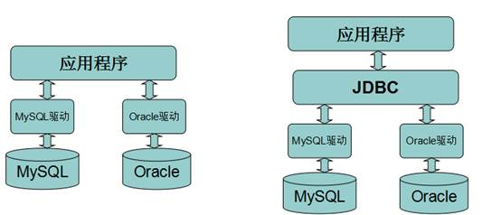

# JDBC

## 概念

### 数据库驱动

数据库厂商提供的用来操作数据库的jar包就叫做数据库的驱动，不同的厂商提供的驱动包不通用。

### JDBC

JDBC（Java DataBase Connectivity）就是Java数据库连接，是SUN公司提供的连接和操作数据库的技术。

说白了就是用Java语言来操作数据库的技术。

由于不同的数据库厂商提供的数据库驱动各不相同,在使用不同数据库时需要学习对应数据库驱动的api，对于开发人员来说学习成本十分的高。

于是sun提供了JDBC的规范，本质上一大堆的接口，要求不同的数据库厂商提供的驱动都实现这套接口，这样一来开发人员只需要学会JDBC这套接口，所有的数据库驱动作为这套接口的实现，就都会使用了。大大降低了学习成本。

### JDBC包

JDBC主要是由 java.sql 和javax.sql包组成的,并且这两个包已经被集成到J2SE的规范中了,这意味着,只要一个普通的java程序就可以使用JDBC。

要注意的是,在开发数据库程序时,除了如上的两个包,还需要手动的导入具体的数据库驱动。




## 入门案例

### 导入驱动包


### 准备数据

```sql
create database day16;
use day16;
create table user(id int,name varchar(255),age int);
insert into user values (1,'aaa',18);
insert into user values (2,'bbb',22);
insert into user values (3,'ccc',31);
```

### 代码实现

```java
public static void main(String[] args) throws SQLException {
        //1.注册数据库驱动
        DriverManager.registerDriver(new Driver());
        //2.获取数据库连接
        Connection conn = DriverManager.getConnection("jdbc:mysql://localhost:3306/day16", "root", "root");
        //3.获取传输器
        Statement stat = conn.createStatement();
        //4.传输sql执行获取结果集
        ResultSet rs = stat.executeQuery("select * from user");
        //5.处理结果
        while(rs.next()){
            int id = rs.getInt("id");
            String name = rs.getString("name");
            int age = rs.getInt("age");
            System.out.println(id+"#"+name+"#"+age);
        }
        //6.关闭资源
        rs.close();
        stat.close();
        conn.close();
    }
```


