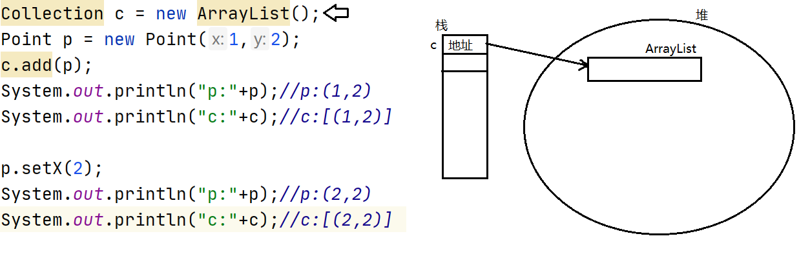
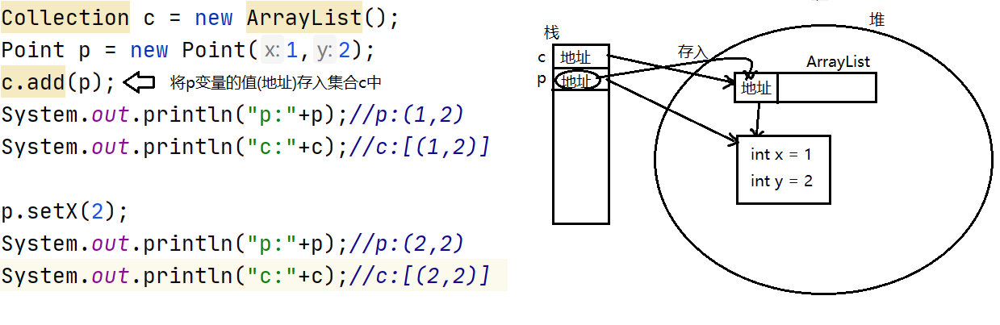
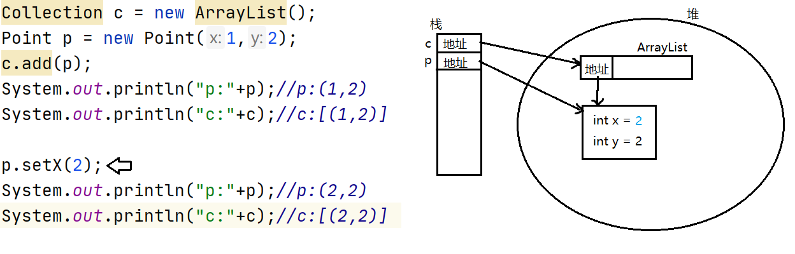

# day03

##  集合框架

#### 什么是集合

集合与数组一样,可以保存一组元素,并且提供了操作元素的相关方法,使用更方便.

#### java集合框架中相关接口

#### java.util.Collection接口:

java.util.Collection是所有集合的顶级接口.Collection下面有多种实现类,因此我们有更多的数据结构可供选择.

#### Collection下面有两个常见的子接口:

- java.util.List:线性表.是可重复集合,并且有序.
- java.util.Set:不可重复的集合,大部分实现类是无序的.

这里可重复指的是集合中的元素是否可以重复,而判定重复元素的标准是依靠元素自身equals比较

的结果.为true就认为是重复元素.

```java
package collection;

import java.util.ArrayList;
import java.util.Collection;

public class CollectionDemo {
    public static void main(String[] args) {
        Collection c = new ArrayList();
        /*
            boolean add(E e)
            向当前集合中添加一个元素.当元素成功添加后返回true
         */
        c.add("one");
        c.add("two");
        c.add("three");
        c.add("four");
        c.add("five");
        System.out.println(c);
        /*
            int size()
            返回当前集合的元素个数
         */
        int size = c.size();
        System.out.println("size:"+size);
        /*
            boolean isEmpty()
            判断当前集合是否为空集(不含有任何元素)
         */
        boolean isEmpty = c.isEmpty();
        System.out.println("是否为空集:"+isEmpty);
        /*
           清空集合
         */
        c.clear();
        System.out.println(c);
        System.out.println("size:"+c.size());//0
        System.out.println("是否为空集:"+c.isEmpty());


    }
}
```


#### 集合与元素equals方法相关的方法

```java
package collection;

import java.util.ArrayList;
import java.util.Collection;
import java.util.HashSet;

/**
 * 集合的很多操作有与元素的equals方法相关。
 */
public class CollectionDemo2 {
    public static void main(String[] args) {
//        Collection c = new ArrayList();
        Collection c = new HashSet();
        c.add(new Point(1,2));
        c.add(new Point(3,4));
        c.add(new Point(5,6));
        c.add(new Point(7,8));
        c.add(new Point(1,2));
        /*
            集合重写了Object的toString方法，输出的格式为:
            [元素1.toString(), 元素2.toString(), ....]
         */
        System.out.println(c);

        Point p = new Point(1,2);
        /*
            boolean contains(Object o)
            判断当前集合是否包含给定元素，这里判断的依据是给定元素是否与集合
            现有元素存在equals比较为true的情况。
         */
        boolean contains = c.contains(p);
        System.out.println("包含:"+contains);
        /*
            remove用来从集合中删除给定元素，删除的也是与集合中equals比较
            为true的元素。注意，对于可以存放重复元素的集合而言，只删除一次。
         */
        c.remove(p);
        System.out.println(c);
    }
}
```

#### 集合存放的是元素的引用

集合只能存放引用类型元素,并且存放的是元素的引用

```java
package collection;

import java.util.ArrayList;
import java.util.Collection;

/**
 * 集合只能存放引用类型元素，并且存放的是元素的引用(地址)
 */
public class CollectionDemo3 {
    public static void main(String[] args) {
        Collection c = new ArrayList();
        Point p = new Point(1,2);
        c.add(p);
        System.out.println("p:"+p);//p:(1,2)
        System.out.println("c:"+c);//c:[(1,2)]

        p.setX(2);
        System.out.println("p:"+p);//p:(2,2)
        System.out.println("c:"+c);//c:[(2,2)]

    }
}
```









#### 集合间的操作

集合提供了如取并集,删交集,判断包含子集等操作

```java
package collection;

import java.util.ArrayList;
import java.util.Collection;
import java.util.HashSet;

/**
 * 集合间的操作
 */
public class CollectionDemo4 {
    public static void main(String[] args) {
//        Collection c1 = new ArrayList();
        Collection c1 = new HashSet();//不可重复元素
        c1.add("java");
        c1.add("c");
        c1.add("c++");
        System.out.println("c1:"+c1);
        Collection c2 = new ArrayList();
        c2.add("android");
        c2.add("ios");
        c2.add("java");
        System.out.println("c2:"+c2);
         /*
            boolean addAll(Collection c)
            将给定集合中的所有元素添加到当前集合中。当前集合若发生了改变则返回true
         */
        boolean tf = c1.addAll(c2);
        System.out.println(tf);
        System.out.println("c1:"+c1);
        System.out.println("c2:"+c2);

        Collection c3 = new ArrayList();
        c3.add("ios");
        c3.add("c++");
        c3.add("php");
        System.out.println("c3:"+c3);
        /*
            boolean containsAll(Collection c)
            判断当前集合是否包含给定集合中的所有元素
         */
        boolean contains = c1.containsAll(c3);
        System.out.println("包含所有元素:"+contains);

        /*
            boolean removeAll(Collection c)
            删除当前集合中与给定集合中的共有元素
         */
        c1.removeAll(c3);
        System.out.println("c1:"+c1);
        System.out.println("c3:"+c3);
    }
}
```


### 集合的遍历

#### Collection提供了统一的遍历集合方式:迭代器模式

Iterator iterator()

该方法会获取一个用于遍历当前集合元素的迭代器.

#### java.util.Iterator接口

迭代器接口,定义了迭代器遍历集合的相关操作.

不同的集合都实现了一个用于遍历自身元素的迭代器实现类,我们无需记住它们的名字,用多态的角度把他们看做为Iterator即可.

迭代器遍历集合遵循的步骤为:问,取,删.其中删除元素不是必要操作

```java
package collection;

import java.util.ArrayList;
import java.util.Collection;
import java.util.Iterator;

/**
 * Collection接口没有定义单独获取某一个元素的操作，因为不通用。
 * 但是Collection提供了遍历集合元素的操作。该操作是一个通用操作，无论什么类型的
 * 集合都支持此种遍历方式:迭代器模式。
 *
 * Iterator iterator()           die(二声)
 * 该方法会获取一个用于遍历当前集合元素的迭代器
 *
 * java.util.Iterator接口，是迭代器接口，规定了迭代器遍历集合的相关操作，不同的
 * 集合都提供了一个用于遍历自身元素的迭代器实现类，不过我们不需要直到它们的名字，以
 * 多态的方式当成Iterator使用即可。
 * 迭代器遍历集合遵循的步骤为:问->取->删
 * 其中删除不是必须操作。
 *
 */
public class IteratorDemo {
    public static void main(String[] args) {
        Collection c = new ArrayList();
        c.add("one");
        c.add("two");
        c.add("three");
        c.add("four");
        c.add("five");
        System.out.println(c);
        //获取迭代器
        Iterator it = c.iterator();
        /*
            迭代器提供的相关方法：
            boolean hasNext()
            判断集合是否还有元素可以遍历

            E next()
            获取集合下一个元素(第一次调用时就是获取第一个元素，以此类推)
         */
        while(it.hasNext()){
            String str = (String)it.next();
            System.out.println(str);         
        }
        System.out.println(c);

    }
}
```

####  迭代器遍历过程中不得通过集合的方法增删元素

```java
package collection;

import java.util.ArrayList;
import java.util.Collection;
import java.util.Iterator;

/**
 * Collection接口没有定义单独获取某一个元素的操作，因为不通用。
 * 但是Collection提供了遍历集合元素的操作。该操作是一个通用操作，无论什么类型的
 * 集合都支持此种遍历方式:迭代器模式。
 *
 * Iterator iterator()           die(二声)
 * 该方法会获取一个用于遍历当前集合元素的迭代器
 *
 * java.util.Iterator接口，是迭代器接口，规定了迭代器遍历集合的相关操作，不同的
 * 集合都提供了一个用于遍历自身元素的迭代器实现类，不过我们不需要直到它们的名字，以
 * 多态的方式当成Iterator使用即可。
 * 迭代器遍历集合遵循的步骤为:问->取->删
 * 其中删除不是必须操作。
 *
 */
public class IteratorDemo {
    public static void main(String[] args) {
        Collection c = new ArrayList();
        c.add("one");
        c.add("#");
        c.add("two");
        c.add("#");
        c.add("three");
        c.add("#");
        c.add("four");
        c.add("#");
        c.add("five");
        System.out.println(c);
        //获取迭代器
        Iterator it = c.iterator();
        /*
            迭代器提供的相关方法：
            boolean hasNext()
            判断集合是否还有元素可以遍历

            E next()
            获取集合下一个元素(第一次调用时就是获取第一个元素，以此类推)
         */
        while(it.hasNext()){
            String str = (String)it.next();
            System.out.println(str);
            if("#".equals(str)){
                /*
                    迭代器要求遍历的过程中不得通过集合的方法增删元素
                    否则会抛出异常:ConcurrentModificationException
                 */
//                c.remove(str);
                /*
                    迭代器的remove方法可以将通过next方法获取的元素从集合
                    中删除。
                 */
                it.remove();
            }
        }
        System.out.println(c);

    }
}
```


### 增强型for循环

JDK5之后推出了一个特性:增强型for循环

- 也称为新循环,使得我们可以使用相同的语法遍历集合或数组.
- 语法:

```
for(元素类型 变量名 : 集合或数组){
    循环体
}
```

```java
package collection;

import java.util.ArrayList;
import java.util.Collection;
import java.util.Iterator;

/**
 * JDK5推出时，推出了一个新的特性:增强型for循环
 * 也称为新循环，它可以用相同的语法遍历集合或数组。
 *
 * 新循环是java编译器认可的，并非虚拟机。
 */
public class NewForDemo {
    public static void main(String[] args) {
        String[] array = {"one","two","three","four","five"};
        for(int i=0;i<array.length;i++){
            String str = array[i];
            System.out.println(str);
        }

        for(String str : array){
            System.out.println(str);
        }


        Collection c = new ArrayList();
        c.add("one");
        c.add("two");
        c.add("three");
        c.add("four");
        c.add("five");
        //迭代器遍历
        Iterator it = c.iterator();
        while(it.hasNext()){
            String str = (String)it.next();
            System.out.println(str);
        }
        //新循环遍历
        for(Object o : c){
            String str = (String)o;
            System.out.println(str);
        }

    }
}
```


### 泛型

JDK5之后推出的另一个特性:泛型

泛型也称为参数化类型,允许我们在使用一个类时指定它当中属性,方法参数或返回值的类型.

- 泛型在集合中被广泛使用,用来指定集合中的元素类型.
- 有泛型支持的类在使用时若不指定泛型的具体类型则默认为原型Object

```java
package collection;

import java.util.ArrayList;
import java.util.Collection;
import java.util.Iterator;

/**
 * JDK5推出时，推出了一个新的特性:增强型for循环
 * 也称为新循环，它可以用相同的语法遍历集合或数组。
 *
 * 新循环是java编译器认可的，并非虚拟机。
 */
public class NewForDemo {
    public static void main(String[] args) {
        String[] array = {"one","two","three","four","five"};
        for(int i=0;i<array.length;i++){
            String str = array[i];
            System.out.println(str);
        }

        for(String str : array){
            System.out.println(str);
        }

        /*
         *  泛型 JDK5之后推出的另一个特性。
         * 泛型也称为参数化类型，允许我们在使用一个类时指定它里面属性的类型，
         * 方法参数或返回值的类型，使得我们使用一个类时可以更灵活。
         * 泛型被广泛应用于集合中，用来指定集合中的元素类型。
         * 支持泛型的类在使用时如果未指定泛型，那么默认就是原型Object
         *
         * Collection接口的定义
         * public interface Collection<E> ... {
         *
         * Collection<E> 这里的<E>就是泛型
         *
         * Collection中add方法的定义，参数为E
         * boolean add(E e)
         */
        Collection<String> c = new ArrayList<>();
        c.add("one");//编译器会检查add方法的实参是否为String类型
        c.add("two");
        c.add("three");
        c.add("four");
        c.add("five");
//        c.add(123);//编译不通过
        //迭代器遍历
        //迭代器也支持泛型，指定的与其遍历的集合指定的泛型一致即可
        Iterator<String> it = c.iterator();
        while(it.hasNext()){
            //编译器编译代码时会根据迭代器指定的泛型补充造型代码
            String str = it.next();//获取元素时无需在造型
            System.out.println(str);
        }
        //新循环遍历
        for(String str : c){
            System.out.println(str);
        }

    }
}
```


### List集

java.util.List接口,继承自Collection.

List集合是可重复集,并且有序,提供了一套可以通过下标操作元素的方法

常用实现类:

- java.util.ArrayList:内部使用数组实现,查询性能更好.
- java.util.LinkedList:内部使用链表实现,首尾增删元素性能更好.

### List集合常见方法

#### get()与set()

```java
package collection;

import java.util.ArrayList;
import java.util.List;

/**
 *  List集合
 *  List是Collection下面常见的一类集合。
 *  java.util.List接口是所有List的接口，它继承自Collection。
 *  常见的实现类:
 *  java.util.ArrayList:内部由数组实现，查询性能更好。
 *  java.util.LinkedList:内部由链表实现，增删性能更好。
 *
 *  List集合的特点是:可以存放重复元素，并且有序。其提供了一套可以通过下标
 *  操作元素的方法。
 */
public class ListDemo {
    public static void main(String[] args) {
        List<String> list = new ArrayList<>();
//        List<String> list = new LinkedList<>();

        list.add("one");
        list.add("two");
        list.add("three");
        list.add("four");
        list.add("five");

        /*
            E get(int index)
            获取指定下标对应的元素
         */
        //获取第三个元素
        String e = list.get(2);
        System.out.println(e);

        for(int i=0;i<list.size();i++){
            e = list.get(i);
            System.out.println(e);
        }

        /*
            E set(int index,E e)
            将给定元素设置到指定位置，返回值为该位置原有的元素。
            替换元素操作
         */
        //[one,six,three,four,five]
        String old = list.set(1,"six");
        System.out.println(list);
        System.out.println("被替换的元素是:"+old);
    }
}
```


####  重载的add()和remove()

```java
package collection;

import java.util.ArrayList;
import java.util.List;

/**
 * List集合提供了一对重载的add,remove方法
 */
public class ListDemo2 {
    public static void main(String[] args) {
        List<String> list = new ArrayList<>();
        list.add("one");
        list.add("two");
        list.add("three");
        list.add("four");
        list.add("five");
        System.out.println(list);
        /*
            void add(int index,E e)
            将给定元素插入到指定位置
         */
        //[one,two,six,three,four,five]
        list.add(2,"six");
        System.out.println(list);

        /*
            E remove(int index)
            删除并返回指定位置上的元素
         */
        //[one,six,three,four,five]
        String e = list.remove(1);
        System.out.println(list);
        System.out.println("被删除的元素:"+e);
    }
}
```


#### subList()方法

```java
package collection;

import java.util.ArrayList;
import java.util.List;

/**
 *  List subList(int start,int end)
 *  获取当前集合中指定范围内的子集。两个参数为开始与结束的下标(含头不含尾)
 */
public class ListDemo3 {
    public static void main(String[] args) {
        List<Integer> list = new ArrayList<>();
        for(int i=0;i<10;i++){
            list.add(i);
        }
        System.out.println(list);
        //获取3-7这部分
        List<Integer> subList = list.subList(3,8);
        System.out.println(subList);
        //将子集每个元素扩大10倍
        for(int i=0;i<subList.size();i++){
            subList.set(i,subList.get(i) * 10);
        }
        //[30,40,50,60,70]
        System.out.println(subList);
        /*
            对子集元素的操作就是对原集合对应元素的操作
         */
        System.out.println(list);

        //删除list集合中的2-8
        list.subList(2,9).clear();
        System.out.println(list);

    }
}
```