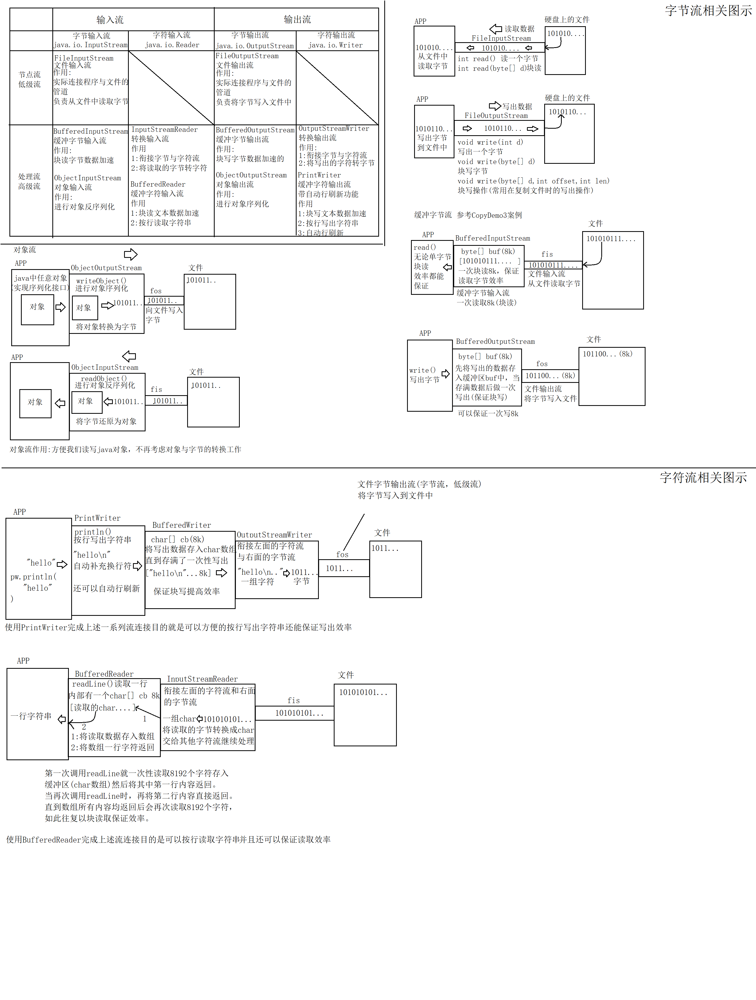

# day06

### 高级流

java将IO分为了两类

- 节点流:又称为"低级流"
  - 特点:直接链接程序与另一端的"管道"，是真实读写数据的流
  - IO一定是建立在节点流的基础上进行的。
  - 文件流就是典型的节点流(低级流)
- 处理流:又称为"高级流"
  - 特点:不能独立存在，必须链接在其他流上
  - 目的:当数据经过当前高级流时可以对数据进行某种加工操作，来简化我们的同等操作
  - 实际开发中我们经常"串联"一组高级流最终到某个低级流上，使读写数据以流水线式的加工处理完成。这一操作也被称为使"**流的链接**"。流链接也是JAVA IO的精髓所在。


#### 缓冲流

java.io.**BufferedInputStream**和**BufferedOutputStream**

##### 功能

在流链接中的作用:**加快读写效率**

通常缓冲是最终链接在低级流上的流

##### 构造器

- 缓冲字节输出流

  ```java
  BufferedOutputStream(OutputStream out)
  实例化一个缓冲字节输出流并链接在指定的字节输出流上。默认缓冲区大小8kb(内部维护的byte[] buf数组长度8192)
  
  BufferedOutputStream(OutputStream out,int size)
  实例化一个指定缓冲区大小的缓冲字节输出流并链接在指定的字节输出流上。
  ```

  

- 缓冲字节输入流

  ```java
  BufferedInputStream(InputStream in)
  实例化一个缓冲字节输入流并链接在指定的字节输入流上。默认缓冲区大小8kb(内部维护的byte[] buf数组长度8192)
  
  BufferedInputStream(InputStream in,int size)
  实例化一个指定缓冲区大小的缓冲字节输入流并链接在指定的字节输入流上。    
  ```


##### 例


```java
package io;

import java.io.*;

/**
 * 使用缓冲流完成文件复制操作
 */
public class CopyDemo3 {
    public static void main(String[] args) throws IOException {
        FileInputStream fis = new FileInputStream("image.png");
        BufferedInputStream bis = new BufferedInputStream(fis);

        FileOutputStream fos = new FileOutputStream("image_cp3.png");
        BufferedOutputStream bos = new BufferedOutputStream(fos);
        int d;
        long start = System.currentTimeMillis();
        while((d=bis.read())!= -1){
            bos.write(d);
        }
        long end = System.currentTimeMillis();
        System.out.println("复制完毕!耗时:"+(end-start)+"ms");
        bis.close();
        bos.close();

    }
}
```

##### 原理

内部定义了一个属性byte buf[]。它等同于我们之前练习复制案例时的块写操作。

并且默认创建时，该buf数组的长度为8192(8kb)长度。

缓冲流在读写数据时**总是以块读写数据**(默认是8kb)来保证读写效率的

**缓冲流提供了多种构造器，可以自行指定缓冲区大小。**


##### 写缓冲问题

由于缓冲输出流会将写出的数据装满内部缓冲区(默认8kb的字节数组)后才会进行一次真实的写出操作。当我们的数据不足时，如果想要及时写出数据，可以调用缓冲流的flush()方法，强制将缓冲区中已经缓存的数据写出一次。

```java
package io;

import java.io.BufferedOutputStream;
import java.io.FileNotFoundException;
import java.io.FileOutputStream;
import java.io.IOException;
import java.nio.charset.StandardCharsets;

/**
 * 缓冲输出流的写缓冲问题
 */
public class BosFlushDemo {
    public static void main(String[] args) throws IOException {
        FileOutputStream fos = new FileOutputStream("bos.txt");
        BufferedOutputStream bos = new BufferedOutputStream(fos);
        String line = "super idol的笑容都没你的甜~";
        byte[] data = line.getBytes(StandardCharsets.UTF_8);
        bos.write(data);
        /*
            void flush()
            强制将缓冲流的缓冲取(内部维护的字节数组)中已经缓存的字节一次性写出
         */
//        bos.flush();
        System.out.println("写出完毕!");
        bos.close();//缓冲输出流的close()方法内部会自动调用一次flush()方法确保数据写出
    }
}

```

##### flush的传递

flush()方法是被定义在java.io.Flushable中。而字节输出流的超类java.io.OutputStream实现了

该接口，这意味着所有的字节输出流都有flush方法。而除了缓冲流之外的高级流的flush方法作用就是调用它链接的流的flush方法将该动作传递下去。最终传递给缓冲流来清空缓冲区。


#### 对象流

java.io.**ObjectInputStream**和**ObjectOutputStream**

##### 作用

- 对象输出流:将我们的java对象进行序列化
- 对象输入流:将java对象进行反序列化

##### 序列化

将一个对象转换为一组**可被传输或保存**的字节。这组字节中除了包含对象本身的数据外，还会包含结构信息。

##### 序列化的意义

实际开发中，我们通常会将对象

- 写入磁盘，进行长久保存
- 在网络间两台计算机中的java间进行传输

无论是保存在磁盘中还是传输，都需要将对象转换为字节后才可以进行。

##### 对象输出流的序列化操作

```java
void writeObject(Object obj)
将给定的对象转换为一组可保存或传输的字节然后通过其链接的流将字节写出
```


##### 例:


```java
package io;

import java.io.*;

/**
 * 对象流
 * 使用对象输出流完成对象序列化操作并最终保存到文件person.obj中
 */
public class OOSDemo {
    public static void main(String[] args) throws IOException {
        String name = "王克晶";
        int age = 18;
        String gender = "女";
        String[] otherInfo = {"黑","嗓门大","java技术好","大家的启蒙老师","来自廊坊佳木斯"};
        Person p = new Person(name,age,gender,otherInfo);
        FileOutputStream fos = new FileOutputStream("person.obj");
        ObjectOutputStream oos = new ObjectOutputStream(fos);
        /*
            对象输出流提供的序列化对象方法:
            void writeObject(Object obj)
            将给定的对象转换为一组可保存或传输的字节然后通过其链接的流将字节写出

            序列化对象时要求该对象对应的类必须实现接口:java.io.Serializable
            如果写出的对象对应的类没有实现该接口，那么writeObject会抛出下面异常
            java.io.NotSerializableException

         */
        oos.writeObject(p);
        System.out.println("对象写出完毕");
        oos.close();
    }
}
```


##### 序列化要求

**对象输出流要求写出的对象必须实现接口:java.io.Serializable**

上述案例中我们看到，如果写出的对象Person没有实现java.io.Serializable时会抛出异常:

**java.io.NotSerializableException**


##### 对象输入流

**java.io.ObjectInputStream**使用对象流可以进行**对象反序列化**

###### 构造器

```java
ObjectInputStream(InputStream in)
将当前创建的对象输入流链接在指定的输入流上   
```

###### 方法

```java
Object readObject()
进行对象反序列化并返回。该方法会从当前对象输入流链接的流中读取若干字节并将其还原为对象。这里要注意读取的字节必须是由ObjectOutputStream序列化一个对象所得到的字节。
```


###### 例

```java
package io;

import java.io.FileInputStream;
import java.io.FileNotFoundException;
import java.io.IOException;
import java.io.ObjectInputStream;

/**
 * 对象输入流，用来进行对象反序列化
 */
public class OISDemo {
    public static void main(String[] args) throws IOException, ClassNotFoundException {
        //读取person.obj文件并将其中保存的数据进行反序列化
        FileInputStream fis = new FileInputStream("person.obj");
        ObjectInputStream ois = new ObjectInputStream(fis);

        Person person = (Person)ois.readObject();
        System.out.println(person);

        ois.close();
    }
}

```


##### transient关键字

当一个属性被transient关键字修饰后，该对象在进行序列化时，转换出来的字节中是不包含该属性的。忽略不必要的属性可以达到对象"瘦身"的操作。

对象瘦身可以在对象持久化时减少磁盘开销。在进行传输时可以缩短传输速度。

如果该对象不需要序列化，那么该关键字不发挥其他任何效果


序列化时不包含otherInfo属性，并且反序列化时该属性值为null


### 字符流

- java将流按照读写单位划分为**字节流与字符流.**
- java.io.InputStream和OutputStream是所有字节流的超类
- **而java.io.Reader和Writer则是所有字符流的超类,它们和字节流的超类是平级关系**.
- Reader和Writer是两个抽象类,里面规定了所有字符流都必须具备的读写字符的相关方法.
- **字符流最小读写单位为字符(char)**,但是底层实际还是读写字节,只是字符与字节的转换工作由字符流完成.
- **字符流都是高级流**

#### 超类

- java.io.Writer 所有字符输入流的超类

  **常用方法**

  ```java
  void write(int c):写出一个字符,写出给定int值”低16”位表示的字符。
  void write(char[] chs):将给定字符数组中所有字符写出。
  void write(String str):将给定的字符串写出
  void write(char[] chs,int offset,int len):将给定的字符数组中从offset处开始连续的len个字符写出
  ```

- java.io.Reader 所有字符输出流的超类

  **常用方法**

  ```java
  int read():读取一个字符，返回的int值“低16”位有效。当返回值为-1时表达流读取到了末尾。
  int read(char[] chs):从该流中读取一个字符数组的length个字符并存入该数组，返回值为实际读取到的字符量。当返回值为-1时表达流读取到了末尾。
  
  ```

  

#### 转换流

java.io.InputStreamReader和OutputStreamWriter是常用的字符流的实现类。

实际开发中我们不会直接操作他们，但是他们在流连接中是必不可少的一环。

##### 流连接中的作用

- 衔接字节流与其他字符流
- 将字符与字节相互转换

##### 意义

实际开发中我们还有功能更好用的字符高级流.但是其他的字符高级流都有一个共通点:不能直接连接在字节流上.而实际操作设备的流都是低级流同时也都是字节流.因此不能直接在流连接中串联起来.转换流是一对可以连接在字节流上的字符流,其他的高级字符流可以连接在转换流上.在流连接中起到"转换器"的作用(负责字符与字节的实际转换)

##### 输出流

###### 构造器

```java
OutputStreamWriter(OutputStream out,Charset cs)
基于给定的字节输出流以及字符编码创建OSW
    
OutputStreamWriter(OutputStream out)
该构造方法会根据系统默认字符集创建OSW
```

示意


例

```java
package io;

import java.io.FileNotFoundException;
import java.io.FileOutputStream;
import java.io.IOException;
import java.io.OutputStreamWriter;
import java.nio.charset.StandardCharsets;

/**
 * 转换流写出文本数据
 */
public class OSWDemo {
    public static void main(String[] args) throws IOException {
        //向文件osw.txt中写出文本数据
        FileOutputStream fos = new FileOutputStream("osw.txt");
        OutputStreamWriter osw = new OutputStreamWriter(fos, StandardCharsets.UTF_8);

        osw.write("夜空中最亮的星，能否听清，");
        osw.write("那仰望的人心底的孤独和叹息。");
        System.out.println("写出完毕");
        osw.close();

    }
}

```


##### 输入流

###### 构造器

```java
InputStreamWriter(InputStream in,Charset cs)
基于给定的字节输入流以及字符编码创建当前转换流
    
InputStreamWriter(InputStream in)
该构造方法会根据系统默认字符集创建当前转换流
```

例

```java
package io;

import java.io.FileInputStream;
import java.io.FileNotFoundException;
import java.io.IOException;
import java.io.InputStreamReader;
import java.nio.charset.StandardCharsets;

/**
 * 使用转换流读取文本数据
 */
public class ISRDemo {
    public static void main(String[] args) throws IOException {
        //将osw.txt文件中的文本信息读取回来
        FileInputStream fis = new FileInputStream("osw.txt");
        InputStreamReader isr = new InputStreamReader(fis, StandardCharsets.UTF_8);
        //00000000 00000000 10011101 01110010
        int d;
        while(( d = isr.read()) != -1) {
            System.out.print((char) d);
        }
        isr.close();
    }
}

```


### 缓冲字符流

#### 缓冲字符输出流-java.io.PrintWriter

- **java.io.BufferedWriter和BufferedReader**

- 缓冲字符流内部也有一个缓冲区,读写文本数据以块读写形式加快效率.并且缓冲流有一个特别的功能:**可以按行读写文本数据**.**缓冲流内部维护一个char数组**，**默认长度8192**.**以块读写方式读写字符数据保证效率**

- java.io.PrintWriter具有自动行刷新的缓冲字符输出流,实际开发中更常用.**它内部总是会自动连BufferedWriter作为块写加速使用**.

##### 工作原理


**特点**

- 可以按行写出字符串

- 具有自动行刷新功能

  

##### 对文件写操作的构造器

```java
PrintWriter(File file)
PrintWriter(String path)
    
还支持指定字符集
PrintWriter(File file,String csn)
PrintWriter(String path,String csn)  
    
上述构造器看似PW可以直接对文件进行操作，但是它是一个高级流，实际内部会进行流连接:
this(new BufferedWriter(new OutputStreamWriter(new FileOutputStream(fileName))),false);
如上面工作原理图
```

##### 例

```java
package io;

import java.io.FileNotFoundException;
import java.io.PrintWriter;
import java.io.UnsupportedEncodingException;
import java.nio.charset.StandardCharsets;

/**
 * 缓冲字符输出流:java.io.PrintWriter
 * 特点:
 * 1:按行写出字符串
 * 2:具有自动的行刷新功能
 *
 */
public class PWDemo {
    public static void main(String[] args) throws FileNotFoundException, UnsupportedEncodingException {
        //向文件中写入文本数据
        /*
            PrintWriter(File file)
            PrintWriter(String path)
         */
        PrintWriter pw = new PrintWriter("pw.txt");
//        PrintWriter pw = new PrintWriter("pw.txt", "UTF-8");
        pw.println("我祈祷拥有一颗透明的心灵，和会流泪的眼睛。");
        pw.println("给我再去相信的勇气，oh越过黄昏去拥抱你。");
        System.out.println("写出完毕");
        pw.close();
    }
}
```


##### 其他构造器

```java
PritWriter(Writer writer)
将当前实例化的PrintWriter链接在指定的字符输出流上    
    
PrintWriter(OutputStream out)    
将当前实例化的PrintWriter链接在指定的字节输出流上
由于除了转换流外的其他字符流都不能直接连在字节流上，因此这个构造器内部会自动链接在BufferedWriter上
并且让BufferedWriter链接在转换流OutputStream上，最后再让转换流链接再指定的字节输出流上
```

##### 例

```java
package io;

import java.io.*;
import java.nio.charset.StandardCharsets;

/**
 *  自行完成流连接向文件写出字符串
 */
public class PWDemo2 {
    public static void main(String[] args) throws FileNotFoundException {
        //负责:将写出的字节写入到文件中
        FileOutputStream fos = new FileOutputStream("pw2.txt");
        //负责:将写出的字符全部转换为字节(可以按照指定的字符集转换)
        OutputStreamWriter osw = new OutputStreamWriter(fos, StandardCharsets.UTF_8);
        //负责:块写文本数据(攒够8192个字符一次性写出)
        BufferedWriter bw = new BufferedWriter(osw);
        //负责:按行写出字符串
        PrintWriter pw = new PrintWriter(bw);

        pw.println("你停在了这条我们熟悉的街,");
        pw.println("把你准备好的台词全念一遍。");

        System.out.println("写出完毕");
        pw.close();
    }
}
```


##### 自动行刷新

PrintWriter支持自动行刷新，每当我们调用println方法写出一行内容后自动flush一次。

```java
对应的构造器
PritWriter(Writer writer,boolean autoflush)
如果第二个参数为true则开启自动行刷新 
```

例

```
package io;

import java.io.*;
import java.nio.charset.StandardCharsets;
import java.util.Scanner;

/**
 * 实现一个简易的记事本工具
 * 利用流连接
 * 在文件输出流上最终链接到PrintWriter上。
 * 然后将用户在控制台上输入的每一行字符串都可以按行写入到对应的文件中。
 * 当用户在控制台上单独输入"exit"时程序退出。
 */
public class AutoFlushDemo {
    public static void main(String[] args) throws FileNotFoundException {
        //负责:将写出的字节写入到文件中
        FileOutputStream fos = new FileOutputStream("note.txt");
        //负责:将写出的字符全部转换为字节(可以按照指定的字符集转换)
        OutputStreamWriter osw = new OutputStreamWriter(fos, StandardCharsets.UTF_8);
        //负责:块写文本数据(攒够8192个字符一次性写出)
        BufferedWriter bw = new BufferedWriter(osw);
        //负责:按行写出字符串
        PrintWriter pw = new PrintWriter(bw,true);//开启自动行刷新

        Scanner scanner = new Scanner(System.in);
        System.out.println("请开始输入内容，单独输入exit退出");
        while(true){
            String line = scanner.nextLine();
            //String可以忽略大小写比较字符串内容:equalsIgnoreCase
            if("exit".equalsIgnoreCase(line)){
                break;
            }
            pw.println(line);//每当println后自动flush。注意:print方法并不会自动flush
        }
        System.out.println("再见!");
        pw.close();
    }
}

```

#### 缓冲字符输入流-java.io.BufferedReader

缓冲字符输入流内部维护一个默认8192长度的char数组，总是以块读取文本数据保证读取效率。

缓冲输入流提供了一个**按行读取文本**数据的方法

```java
String readLine()
返回一行字符串。方法内部会连续扫描若干个字符，直到遇到换行符为止，将换行符之前的内容以一个字符串形式返回。
返回的字符串中不含有最后的换行符。
返回值有三种情况:
1:正常一行内容
2:空字符串。当读取了一个空行时(这一行只有一个换行符)。
3:null。当流读取到了末尾时。  
    
当我们第一次调用readLine()时，流并不是只读取了一行字符串，而是先进行块读操作(一次性读取8192个字符并转入到内部的char数组中)，然后扫描内部的char数组，然后将第一行字符串返回。第二次调用后再继续扫描后去的内容以此类推。    
```

##### 例

```java
package io;

import java.io.*;

/**
 * 使用缓冲字符输入流读取文本数据
 */
public class BRDemo {
    public static void main(String[] args) throws IOException {
        //将当前源代码输出到控制台上
        /*
            1:创建文件输入流读取当前源代码文件
            2:进行流连接最终链接到BufferedReader上
            3:读取每一行字符串并输出到控制台上
         */
        FileInputStream fis = new FileInputStream(
                "./src/main/java/io/BRDemo.java"
        );
        InputStreamReader isr = new InputStreamReader(fis);
        BufferedReader br = new BufferedReader(isr);

        String line;
        while((line = br.readLine())!=null) {
            System.out.println(line);
        }
        br.close();
    }
}

```


### IO总结




## 总结

### JAVA IO必会概念:

- java io可以让我们用标准的读写操作来完成对不同设备的读写数据工作.
- java将IO按照方向划分为输入与输出,参照点是我们写的程序.
- **输入**:用来读取数据的,是从外界到程序的方向,用于获取数据.
- **输出**:用来写出数据的,是从程序到外界的方向,用于发送数据.

java将IO比喻为"流",即:stream. 就像生活中的"电流","水流"一样,它是以同一个方向顺序移动的过程.只不过这里流动的是字节(2进制数据).所以在IO中有输入流和输出流之分,我们理解他们是连接程序与另一端的"管道",用于获取或发送数据到另一端.

**因此流的读写是顺序读写的，只能顺序向后写或向后读，不能回退。**

##### Java定义了两个超类(抽象类):

- **java.io.InputStream**:所有字节输入流的超类,其中定义了读取数据的方法.因此将来不管读取的是什么设备(连接该设备的流)都有这些读取的方法,因此我们可以用相同的方法读取不同设备中的数据

  ```
  常用方法:
  
  int read()：读取一个字节，返回的int值低8位为读取的数据。如果返回值为整数-1则表示读取到了流的末尾
  
  int read(byte[] data)：块读取，最多读取data数组总长度的数据并从数组第一个位置开始存入到数组中，返回值表示实际读取到的字节量，如果返回值为-1表示本次没有读取到任何数据，是流的末尾。
  ```

- **java.io.OutputStream**:所有字节输出流的超类,其中定义了写出数据的方法.

  常用方法:

  void write(int d)：写出一个字节，写出的是给定的int值对应2进制的低八位。

  void write(byte[] data)：块写，将给定字节数组中所有字节一次性写出。

  void write(byte[]data,int off,int len)：块写，将给定字节数组从下标off处开始的连续len个字节一次性写出。

##### java将流分为两类:节点流与处理流:

- **节点流**:也称为**低级流**.

  节点流的另一端是明确的,是实际读写数据的流,读写一定是建立在节点流基础上进行的.

- **处理流**:也称为**高级流**.

  处理流不能独立存在,必须连接在其他流上,目的是当数据流经当前流时对数据进行加工处理来简化我们对数据的该操作.

##### 实际应用中,我们可以通过串联一组高级流到某个低级流上以流水线式的加工处理对某设备的数据进行读写,这个过程也成为流的连接,这也是IO的精髓所在.

### 文件流

文件流是一对低级流，**用于读写文件的流**。

#### java.io.FileOutputStream文件输出流，继承自java.io.OutputStream

#### 常用构造器

##### 覆盖模式对应的构造器

```
覆盖模式是指若指定的文件存在，文件流在创建时会先将该文件原内容清除。
```

- FileOutputStream(String pathname)：创建文件输出流用于向指定路径表示的文件做写操作

- FileOutputStream(File file)：创建文件输出流用于向File表示的文件做写操作。

  注:如果写出的文件不存在文件流自动创建这个文件，但是如果该文件所在的目录不存在会抛出异常:java.io.FileNotFoundException

##### 追加写模式对应的构造器

```
追加模式是指若指定的文件存在，文件流会将写出的数据陆续追加到文件中。
```

- FileOutputStream(String pathname,boolean append)：如果第二个参数为true则为追加模式，false则为覆盖模式
- FileOutputStream(File file,boolean append)：同上

##### 常用方法:

```
void write(int d)：向文件中写入一个字节，写入的是int值2进制的低八位。

void write(byte[] data)：向文件中块写数据。将数组data中所有字节一次性写入文件。

void write(byte[] data,int off,int len)：向文件中快写数据。将数组data中从下标off开始的连续len个字节一次性写入文件。
```

#### java.io.FileInputStream文件输入流，继承自java.io.InputStream

##### 常用构造器

FileInputStream(String pathname) 创建读取指定路径下对应的文件的文件输入流，如果指定的文件不存在则会抛出异常java.io.FileNotFoundException

FileInputStream(File file) 创建读取File表示的文件的文件输入流，如果File表示的文件不存在则会抛出异常java.io.IOException。

##### 常用方法

```
int read()：从文件中读取一个字节，返回的int值低八位有效，如果返回的int值为整数-1则表示读取到了文件末尾。

int read(byte[] data)：块读数据，从文件中一次性读取给定的data数组总长度的字节量并从数组第一个元素位置开始存入数组中。返回值为实际读取到的字节数。如果返回值为整数-1则表示读取到了文件末尾。
```


## 缓冲流

缓冲流是一对高级流，在流链接中链接它的**目的是加快读写效率**。缓冲流内部**默认缓冲区为8kb**，缓冲流**总是块读写数据来提高读写效率**。

#### java.io.BufferedOutputStream缓冲字节输出流，继承自java.io.OutputStream

##### 常用构造器

- BufferedOutputStream(OutputStream out)：创建一个默认8kb大小缓冲区的缓冲字节输出流，并连接到参数指定的字节输出流上。
- BufferedOutputStream(OutputStream out,int size)：创建一个size指定大小(单位是字节)缓冲区的缓冲字节输出流，并连接到参数指定的字节输出流上。

##### 常用方法

```
flush()：强制将缓冲区中已经缓存的数据一次性写出

缓冲流的写出方法功能与OutputStream上一致，需要知道的时write方法调用后并非实际写出，而是先将数据存入缓冲区(内部的字节数组中)，当缓冲区满了时会自动写出一次。
```

#### java.io.BufferedInputStream缓冲字节输出流，继承自java.io.InputStream

##### 常用构造器

- BufferedInputStream(InputStream in)：创建一个默认8kb大小缓冲区的缓冲字节输入流，并连接到参数指定的字节输入流上。
- BufferedInputStream(InputStream in,int size)：创建一个size指定大小(单位是字节)缓冲区的缓冲字节输入流，并连接到参数指定的字节输入流上。

##### 常用方法

```java
缓冲流的读取方法功能与InputStream上一致，需要知道的时read方法调用后缓冲流会一次性读取缓冲区大小的字节数据并存入缓冲区，然后再根据我们调用read方法读取的字节数进行返回，直到缓冲区所有数据都已经通过read方法返回后会再次读取一组数据进缓冲区。即:块读取操作
```


## 对象流

对象流是一对高级流，在流链接中的作用是完成对象的**序列化**与**反序列化**

序列化：是对象输出流的工作，将一个对象按照其结构转换为一组字节的过程。

反序列化：是对象输入流的工作，将一组字节还原为对象的过程。

#### java.io.ObjectInputStream对象输入流，继承自java.io.InputStream

##### 常用构造器

ObjectInputStream(InputStream in)：创建一个对象输入流并连接到参数in这个输入流上。

##### 常用方法

Object readObject()：进行对象反序列化，将读取的字节转换为一个对象并以Object形式返回(多态)。

如果读取的字节表示的不是一个java对象会抛出异常:java.io.ClassNotFoundException

#### java.io.ObjectOutputStream对象输出流，继承自java.io.OutputStream

##### 常用构造器

ObjectOutputStream(OutputStream out)：创建一个对象输出流并连接到参数out这个输出流上

##### 常用方法

void writeObject(Object obj)：进行对象的序列化，将一个java对象序列化成一组字节后再通过连接的输出流将这组字节写出。

**如果序列化的对象没有实现可序列化接口:java.io.Serializable就会抛出异常:java.io.NotSerializableException**

#### 序列化接口java.io.Serrializable

该接口没有任何抽象方法，但是只有实现了该接口的类的实例才能进行序列化与反序列化。

实现了序列化接口的类建议显示的定义常量:static final long serialVersionUID = 1L;

可以为属性添加关键字**transient**，被该关键字修饰的属性在序列化是会被忽略，达到对象**序列化瘦身**的目的。


## 字符流

java将流按照读写单位划分为字节与字符流。字节流以字节为单位读写，字符流以字符为单位读写。

### 转换流java.io.InputStreamReader和OutputStreamWriter

功能无需掌握，了解其核心意义:

1:衔接其它字节与字符流

2:将字符与字节进行转换

相当于是现实中的"转换器"

### 缓冲字符输出流

缓冲字符输出流需要记住的是PrintWriter和BufferedReader

作用:

1:块写或块读文本数据加速

2:可以按行写或读字符串

#### java.io.PrintWriter 具有自动行刷新的缓冲字符输出流

##### 常用构造器

PrintWriter(String filename) :可以直接对给定路径的文件进行写操作

PrintWriter(File file):可以直接对File表示的文件进行写操作

上述两种构造器内部会自动完成流连接操作。

PrintWriter(OutputStream out):将PW链接在给定的字节流上(构造方法内部会自行完成转换流等流连接)

PrintWriter(Writer writer):将PW链接在其它字符流上

PrintWriter(OutputStream out,boolean autoflush)

PrintWriter(Writer writer,boolean autoflush)

上述两个构造器可以在链接到流上的同时传入第二个参数，如果该值为true则开启了自动行刷新功能。

##### 常用方法

void println(String line)：按行写出一行字符串

##### 特点

自动行刷新，当打开了该功能后，每当使用println方法写出一行字符串后就会自动flush一次