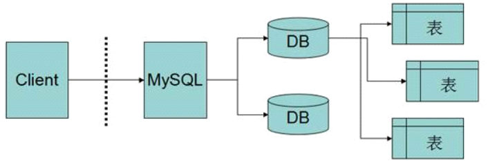
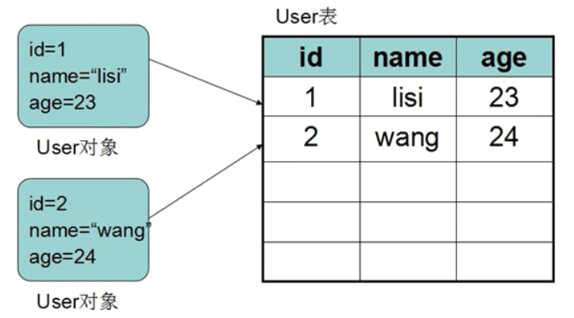

# SQL

## 基本概念

### 数据库

数据库，简而言之就是存储数据的仓库，可以按照一定的数据结构存储管理大量的数据及数据 与数据之间的关系，它本质上是一种信息管理系统。数据库根据存储采用的数据结构的不同可 以分为许多种，其中常见的有层次式数据库、网络式数据库、关系型数据库。其中关系型数据 库占据着市场的主流。

### 关系型数据库

关系型数据库是建立在关系模型基础上的数据库。这种定义听起来十分抽象，这里我们不深入 讨论什么叫做“关系模型”--大学计算机专业专门有一门课叫“离散数学”专门讨论过关系模 型，只是简单的表述为 利用表来存储数据，用表和表之间的关系保存数据之间的关系的数据库 称为关系型数据库，这个定义不太严谨，但是更好理解。

### 常见关系型数据库

#### 商业数据库： 

> Oracle -- 甲骨文公司开发
>
> SQLServer -- 微软公司开发，.Net技术中常用 
>
> DB2 -- IBM公司开发 
>
> Sybase -- Sybase公司开发

#### 开源数据库:

> MySql -- 瑞典MySql AB研发，非常受欢迎，已经被Oracle收购 
>
> SQLite -- 小型轻量级开源关系型数据库，常用作嵌入式设备数据库

## MySQL常见概念

### 数据库服务器

指的就是一个数据库管理程序，这个程序可以管理多个数据库。 具体来看就是在系统中运行的mysql的服务。 该服务器根据配置监听当前机器的指定端口(默认3306)等待客户端的连接访问。

### 数据库客户端

用来连接数据库服务器进行数据库操作的程序称之为数据库客户端程序，简称数据库客户端。 

mysql自带了客户端程序，即bin/mysql.exe，可以通过该程序连接数据库服务器。

### 数据库

所谓的数据库就是在数据库服务器中创建的以一系列的表的形式存储数据的仓库。 一个数据库服务器中可以创建多个数据库。 多个数据库之间是互相隔离的。 通常一个项目对应一个数据库。 每个项目各自创建和使用各自的数据库，从而可以实现多个项目在一个数据库服务器中互不干扰的 工作。

### 表

数据库中以表来存储数据。

 一个数据库中可以创建多个表。 

通常一个javabean类对应一个表。



### 表记录

表中一条数据就是一个表记录。 

一个表中可以存储多条表记录。 

通常一个javabean对象对应一个表记录。



## SQL语言

### 概念

> SQL--Structured Query Language, 结构化查询语言,是关系型数据库通用的操作语言。 
>
> 是一种非过程性语言。
>
>  由美国国家标准局(ANSI）与国际标准化组织（ISO）制定SQL标准。
>
> 各大数据库厂商都对其做了实 现。所以我们只要学会了SQL语言，就可以操作各大关系型数据库了。 
>
> 为加强SQL的语言能力，各厂商增强了过程性语言的特征,增加了一些非标准的SQL，这样的SQL称 为该数据库的“方言”。
>
>  SQL是用来存取关系数据库的语言，具有查询、操纵、定义和控制关系型数据库的四方面功能

### 分类

•**数据定义语言（**DDL**）**: Data Definition Language

•**数据操纵语言（**DML**） **: Data Manipulation Language

•**数据查询语言（**DQL**） **：Data Query Language

•**事务控制语言（**TCL**） **：Transaction Control Language

•**数据控制语言（**DCL**） **: Data Control Language

## DDL

Data Definition Language  数据定义语言

用于建立、修改、删除数据库对象

包括:

CREATE: 创建表或其他对象结构

ALTER:修改表或其他对象结构

DROP:删除表或其他对象结构

TRUNCATE:摧毁并重建表


### 创建数据库

#### 语法

```sql
CREATE DATABASE [IF NOT EXISTS] db_name [create_specification [, create_specification] ...]
```

**IF NOT EXISTS:**

在创建前判断是否存在，如果不存在则创建，存在则不创建也不报错

**create_specification:**

CHARACTER SET charset_name #数据库默认编码集 

COLLATE collation_name #数据库默认校对规则

#### 练习

1) 创建一个名称为mydb1的数据库

   ```sql
   CREATE DATABASE mydb1;
   ```

2) 创建一个使用gbk字符集的mydb2数据库

   ```sql
   CREATE DATABASE mydb2 character set gbk;
   ```

3) 创建一个使用utf8字符集，并带校对规则utf8_bin的mydb3数据库

   ```sql
   CREATE DATABASE mydb3 character set utf8 collate utf8_bin;
   ```

   ## 查询数据库

   