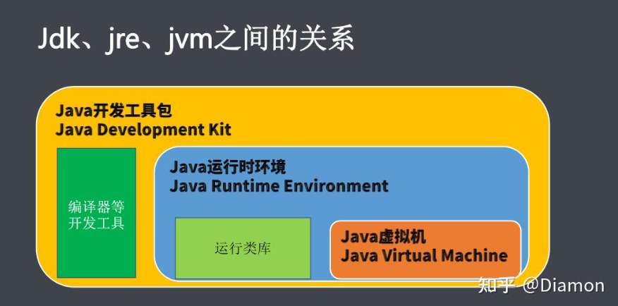
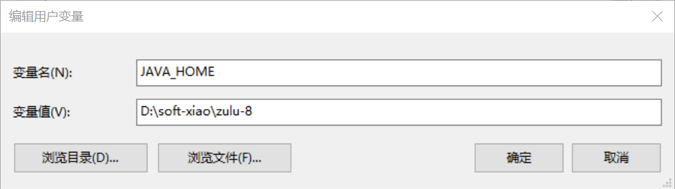
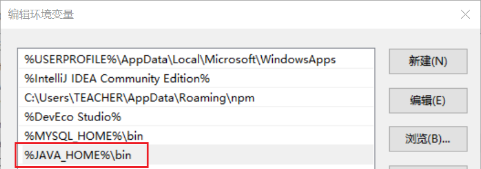
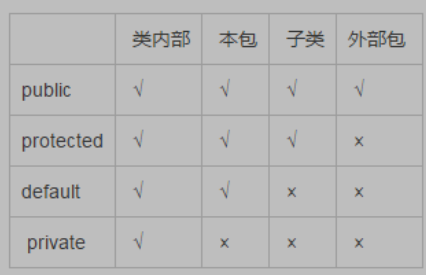
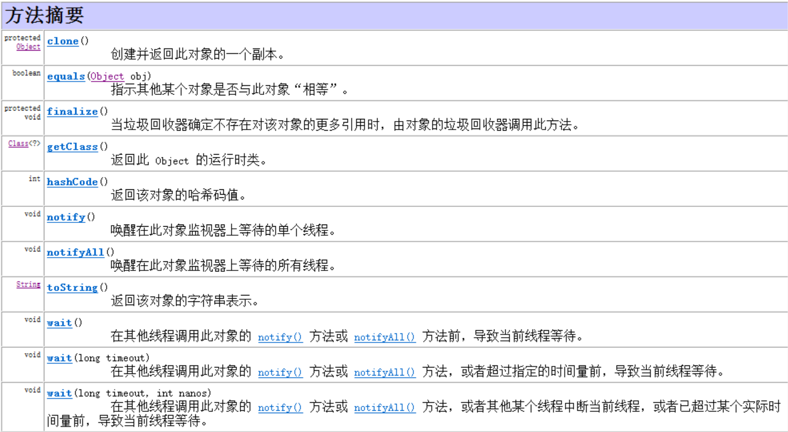
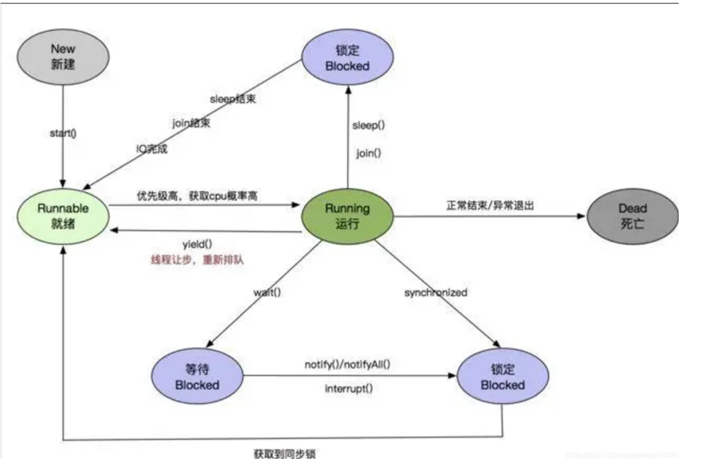

# 第一教学月复习

## 开发环境

### Java程序开发过程

.java  --编译-->  .class  --类加载-->  内存字节码

### JDK特性

跨平台性 -- 一次编译到处运行 -- 虚拟机

### JVM、JRE、JDK

JVM java虚拟机

> 虚拟机内核，负责加载.class并运行.class

JRE Java运行时环境

> 除了包含JVM以外还包含了运行java程序所必须的环境
>
> JRE = JVM+java系统类库(小零件)

JDK java开发工具包

> - 除了包含JRE以外还包含了开发java程序所必须的命令工具
> - JDK = JRE+编译、运行等命令工具



### JDK安装配置

#### 下载

https://www.oracle.com/java/technologies/downloads/

#### 安装

图形化安装 下一步 即可

#### 配置

配置**JAVA_HOME**环境变量，指向JDK的安装目录

这样配置的原因是因为很多java写成的软件都会去找这个环境变量，用于寻找jdk的安装位置



配置**PATH**环境变量，指向JDK的bin目录



## 变量

### 命名

- 只能包含字母、数字、_和$符，不能以数字开头
- 严格区分大小写
- 不能使用关键字
- 允许中文命名，但不建议，建议"英文的见名知意"、"小驼峰命名法"

## 基本数据类型

byte short int long float double char boolean 	

- int：整型，4个字节，-21个多亿到21个多亿

  - 整数直接量默认为int类型，但不能超出范围，若超范围则发生编译错误
  - 两个整数相除，结果还是整数，小数位无条件舍弃(不会四舍五入)
  - 运算时若超出范围，则发生溢出，溢出不是错误，但是需要避免

- long：长整型，8个字节，-900万万亿多到900万万亿多

  - 若想表示长整型直接量，需在数字后加L或l 
  - 运算时若有可能溢出，建议在第1个数字后加L

- double：浮点型，8个字节，很大很大很大

  - 小数直接量默认为double型，若想表示float，需在数字后加F或f
  - 不能表示精确数据，运算时有可能会发生舍入误差，精确场合不能使用

- boolean：布尔型，1个字节

  - 只能存储true或false

- char：字符型，2个字节

  - 采用的是Unicode编码格式，一个字符对应一个码

    表现的形式是字符char，但本质上是码int(0到65535之间)

    (ASCII：'a'----97     'A'----65    '0'----48)

  - 字符型直接量必须放在单引号中，有且仅有1个

  - 特殊符号需要通过\来转义

### 类型间转换

基本数据类型从小到大依次为：

- byte----short----int----long----float----double

  ​               char----

- 两种方式：

  - 自动/隐式类型转换：小类型到大类型
  - 强制类型转换：大类型到小类型
    - 语法：(要转换成为的数据类型)变量
    - 注意：强转有可能会溢出或丢失精度

- 两点规则：

  - 整数直接量可以直接赋值给byte,short,char，但不能超出范围

  - byte,short,char型数据参与运算时，系统会将其自动转换为int类型再运算

## 运算符

### 算数运算符

+-*/%++--

- %:取模/取余，余数为0即为整除

- ++/--:自增1/自减1，可在变量前也可在变量后

  - 单独使用时，在前在后都一样
  - 被使用时，在前在后不一样
    - a++的值为a------------(a--的值为a)
    - ++a的值为a+1--------(--a的值为a-1)

### 关系运算符

：>、<、>=、<=、==、!=

### 逻辑运算符

&&、||、!

短路与、短路或

### 赋值运算符

=、+=、-=、*=、/=、%=

### 字符串拼接运算

- 若两边为数字，则做加法运算
- 若两边(任意边)出现了字符串，则做字符串连接
- 任何类型的数据与字符串连接，结果都会变为字符串型

### 三元表达式

布尔表达式 ? 值1:值2

## 分支结构

### if

if(条件){}

if(条件){}else{}

if(条件1){}else if(条件2){}..else{}

### switch..case..

数据类型:byte,short,int,char,String,枚举

break的使用:case是入口，从第一个匹配的case进入之后向下执行，后续所有的case和default都会执行，如果需要跳过则必须手动break

## 循环结构

while(){}

do{}while()

for()

继续循环：continue

跳出循环：break

## 数组

### 排序

冒泡排序、选择排序、插入排序

希尔排序、快速排序、归并排序...

### 查找

二分查找法

## 方法

#### 定义

```java
修饰词  返回值类型  方法名(参数列表){
    方法体---------具体的业务逻辑功能实现
}
```

#### 调用

无返回值：方法名(有参传参);

有返回值：数据类型  变量  = 方法名(有参传参);

#### 重载

- 发生在同一类中，方法名相同，参数列表不同
- 编译器在编译时会根据方法的签名自动绑定方法

## 面向对象

实体 --  对象(特性/属性 行为/方法) -- 类

万物皆对象

### 类

### this关键字

### 构造方法

默认自带空的无参构造

但如果自己指定了构造器，则不再具备默认无参构造

构造器和普通方法的区别是没有返回值

可以用访问权限修饰符修饰

如果为非public，则只能在权限控制范围内通过该构造器创建对象

可以声明多个构造器实现构造器的重载

### JVM内存结构

栈、堆、方法区

### 值传递、引用传递

基本数据类型是值传递，目标方法对值的改变不影响原方法中引用的值

复杂数据类型是引用传递，目标方法对值的改变影响原方法中引用的值

## 面向对象特性

抽象 --> 封装 --> 继承 --> 多态

### 封装

- public：公开的，任何类

- private：私有的，本类

- protected：受保护的，本类、派生类、同包类

- 默认的：什么也不写，本类、同包类--------------------------java不建议




### 继承

一个类可以由另一个类扩展而来，此时无需从新定义，而只需使用新的类继承原有类，在原有类上进行扩展即可。

这称之为发生了类的继承。

被继承的类称之为父类，继承的类称之为子类，子类继承了父类，从父类中派生出了子类。

java的继承是单继承。

通过继承可以实现继承的结构树。

子类的构造器的第一行必须调用父类构造器，保证在初始化子类对象时，能够初始化到父类中继承来的属性

通过super关键字可以显式访问父类中的属性和方法

- 作用：代码复用

- 通过extends实现继承

- 超类/基类/父类：共有的属性和行为

  派生类/子类：特有的属性和行为

- 派生类可以访问：超类的+派生类的，超类不能访问派生类的

- 一个超类可以有多个派生类，一个派生类只能有一个超类---------单一继承

- 具有传递性

#### 重写

子类覆盖父类中的方法

- 发生在父子类中，方法名相同，参数列表相同

- 重写方法被调用时，看对象的类型---------------new谁就调谁的，这是规定

### 多态

#### 向上造型、向下转型

- 向上造型/自动类型转换：

  - 超类型的引用指向派生类的对象
  - 能点出来什么，看引用的类型--------------这是规定，记住它

- 向下转型/强制类型转换，成功的条件只有如下两种：

  - 引用所指向的对象，就是该类型
  - 引用所指向的对象，实现了该接口或继承了该类

- 强转时若不符合如上条件，则发生ClassCastException类型转换异常

  > 建议：在强转之前先通过instanceof来判断引用的对象是否是该类型
  >
  > 注意：instanceof返回boolean结果，它为true的条件就是强转成功的条件
  >
  > 何时需要强转：若想访问的属性/行为在超类中没有，则需要强制类型转换

#### 重写、重载

重写通过子类覆盖父类方法提供了方法的不同实现，体现了多态

重载通过同名不同参的方法实现，体现了多态

### 抽象

#### 抽象方法

通过abstract关键字声明，只有方法声明没有方法体的方法

#### 抽象类

抽象类不能也不是用来创建实例的，而是专门用来被继承的

用于统一继承结构树

其中可以包含抽象方法和非抽象方法，定义该类型应具有的特性和行为

### 接口

- 是一种引用数据类型
- 由interface定义
- 只能包含抽象方法(常量、默认方法、静态方法、私有方法------暂时搁置)
- 不能被实例化
- 接口是需要被实现/继承的，实现类/派生类：必须重写接口中的所有抽象方法
  - 注意：重写接口中的方法时，必须加public(先记住)
- 一个类可以实现多个接口，用逗号分隔。若又继承又实现时，应先继承后实现
- 接口可以继承接口

```java
interface x{
    //常量
    final String name = "zs";
    //抽象方法
    public abstract void say();
    //默认方法 jdk8
    default void run(){
        System.out.println("跑..");
    }
    //静态方法 jdk8
    static void eat(){
        System.out.println("吃..");
    }
    //私有方法 jdk9,只能在当前接口内调用
//    private void sleep(){
//        System.out.println("睡..");
//    }
}
```

### final最终

用在引用上:变量变为了常量

用在方法上:不能被重写

用在类上:不能被继承

### static静态

- 静态变量：
  - 由static修饰
  - 属于类，存储在方法区中，只有一份
  - 常常通过类名点来访问
  - 何时用：对象所共享的数据
- 静态块：
  - 由static修饰
  - 属于类，在类被加载期间自动执行，一个类只被加载一次，所以静态块也只执行一次
  - 何时用：初始化/加载静态资源/静态变量
- 静态方法：
  - 由static修饰
  - 属于类，存储在方法区中，只有一份
  - 常常通过类名点来访问
  - 静态方法中没有隐式this传递，所以静态方法中不能直接访问实例成员(实例变量/实例方法)
  - 何时用：方法的操作与对象无关(不需要访问对象的属性/行为)

### 枚举

### 内部类

类中套类，外面的称为外部类，里面的称为内部类

- 内部类通常只服务于外部类，对外不具备可见性

- 内部类对象通常在外部类中创建

- 内部类可以直接访问外部类的成员，在内部类中有个隐式的引用指向创建它的外部类对象

  > 隐式的引用：外部类名.this

- 何时用：若A类(Baby)只让B类(Mama)用，并且A类(Baby)还想访问B类(Mama)的成员时，可以设计成员内部类

匿名内部类：应用率高，掌握

- 何时用：若想创建一个派生类的对象，并且对象只创建一次，可以设计为匿名内部类，可以大大简化代码
- 注意：匿名内部类中不能修改外面局部变量的值
- 小面试题：
  - 问：内部类有独立的.class吗?
  - 答：有

## String

### 特点

String用来表示一个字符串。具有以下特点:

•java.lang.String使用了final修饰，不能 被继承；

•字符串底层封装了字符数组及针对字符数组的操作算法；

•字符串一旦创建，对象永远无法改变，但字符串引用可以重新赋值；

•Java字符串在内存中采用Unicode编码方式，任何一个字符对应两个字节的定长编码。

### 字符串常量池

java在堆内存中开辟了一段空间用于缓存所有使用字面量形式创建的字符串对象，并在后期再次使用该字面量创建字符串时重用对象，避免内存中堆积大量内容一样的字符串对象来减小内存开销。

对于重复出现的字符串直接量，JVM会首先在常量池中查找，如果存在即返回该对象地址。

### 字符串常用方法

## StringBuilder StringBuffer

由于String是不变对象,每次修改内容都要创建新对象,因此String不适合做频繁修改操作.为了解决这个问题,java提供了StringBuilder类.

StringBuffer 和StringBuilder 

– StringBuffer是线程安全的，同步处理的，性能稍慢

–StringBuilder是非线程安全的，并发处理的，性能稍快

## 正则表达式

略

## Object类

所有的类的根



## 包装类

略

## 集合

### 继承结构

```java
Collection
|-List 长度可变、可以重复、有序的集合
    |-ArrayList
    |-LinkedList
|-Set 不可重复，大多数实现下无序的集合
    |-HashSet
    |-TreeSet
```

### 基本操作

略

### 迭代

可以通过迭代器快速遍历数据

并可以在增强for循环中遍历

想要能够被迭代，需要：

实现Iterable接口

实现其中定义的iterator方法

在这个方法中返回Iterator的实现类的对象

在该实现类中实现hasNext和next方法

### Collections工具类

略

## 文件

File

## IO

IO流 - InputOutputStream - 从程序中读取输出数据的流的技术

### 四大基本流

都是抽象流无法直接使用

其他具体功能的流都派生自这四大基本流

| 基本流     | 输入流      | 输出流       |
| ---------- | ----------- | ------------ |
| **字节流** | InputStream | OutputStream |
| **字符流** | Reader      | Writer       |

### 文件流

| 文件流     | 输入流          | 输出流           |
| ---------- | --------------- | ---------------- |
| **字节流** | FileInputStream | FileOutputStream |
| **字符流** | FileReader      | FileWriter       |

### 流的缓冲

通过如下方法一次读写一个字节，效率太低

int read()

write(int i)

实际上java还提供了一次读写大量数据的API

int read(byte[])

write(byte [] ,int,int )

通过使用数组对接两个流，可以有效的提升IO效率

flush()方法

刷流，防止数据堆积在缓冲区中

### 缓冲流

| 缓冲流     | 输入流              | 输出流               |
| ---------- | ------------------- | -------------------- |
| **字节流** | BufferedInputStream | BufferedOutputStream |
| **字符流** | BufferedReader      | BufferedWriter       |

### 对象流 - 序列化、反序列化

ObjectInputStream

ObjectOutputStream

Serializable接口

transient关键字

*任何想要被序列化、反序列化的对象，它的类都必须实现Serializable接口

*如果希望某个字段不被序列化，可以使用transient关键字修饰

### 转换流 - 将字节流包装成字符流

InputStreamReader

OutputStreamWriter

#### 打印流

PrintWriter

## 异常

java提供的在方法调用时从被调用者向调用者传递错误信息的绿色通道

### 异常的继承结构

```java
Throwable
|-Error 错误   --  无需声明 可以不处理 默认会一直向上抛 直到虚拟机停止线程
|-Exception 异常
	|-RuntimeException  运行时异常  --  无需声明 可以不处理 默认会一直向上抛 直到虚拟机停止线程
	|-XxxException	编译时异常  --  必需声明 必须处理 要么当场捕获 要么声明继续向上抛出
```

## 网络编程 - Socket

ServerSocket - 服务器端 - Accept - IO流 -close

Socket - 客户端 - Connect - IO流 - close

## 多线程 - Thread

### 进程、线程概念

一个程序就是一个进程，操作系统中多个进程抢夺CPU时间片执行，快速切换，看起来就好像在并行执行一样，称之为多进程

一个程序中可以开启多个并行的任务，即线程，多个线程抢夺cpu时间片执行，快速切换，看起来就好像在并行执行一样，称之为多线程

### 线程创建方式

### 线程之间的关系

> 程序从main方法启动时，本身就是启动了一个线程称之为主线程
>
> 任意线程中都可以开启新的线程
>
> 默认情况下，线程之间都是平等的，平等的抢夺cpu执行
>
> 默认情况下，只有程序中所有的线程都结束了，程序才会结束

### 多线程并发安全问题

多个线程并发访问同一共享资源造成的混乱

加锁 syncronized

锁对象的选择

集合类安全API

### 线程间的通信

等待唤醒机制

### 线程声明周期




## Map

存储键值类型数据的数据结构.

底层原理为Hash分桶算法.

## 反射

将类、方法、属性、构造器、包等和类相关的实体，抽象为相关类，

通过这些类获取信息进行操作

从而实现对类的间接控制

这样的技术称为反射

在框架级别的程序开发中非常重要


Class类

Filed类

Method类

Constructor类

Package类

## 注解

注释: 给人看的提示信息

注解: 给程序看的提示信息

可以根据 有没有注解 或 注解上的属性值的不同 决定程序按照不同的方式去运行
本质上是对程序进行的配置,是对配置文件的一种替代方案
相对于配置文件,它更加轻量级,简单 方便 易用,便于管理
现代开发中,很多时候,配置文件用于配置核心的选项,而注解用于配置其它轻量级配置.

### JDK的原生注解

> @Override - 声明重写
> @Deprecated - 声明过时
> @SupressWarnings - 压制警告

### 自定义注解

声明注解

元注解标注

声明注解的属性

### 反射注解

boolean  isAnnotationPresent(Class anno) -- 判断当前类上是否有指定类型的注解
Annotation [] getAnnotations(); -- 获取当前类上声明的所有注解
Annotation getAnnotation(Class annoClz); -- 获取当前类上的指定类型的注解

## SQL

### 约束

主键约束

非空约束

唯一约束

check约束

default约束

外键约束

### 多表设计

一对一

一对多

多对多

### 多表查询

笛卡尔积查询

内连接查询

外连接查询

左外连接查询

右外连接查询

全外连接查询

## JDBC

### 数据库驱动

### JDBC

### 六个步骤实现JDBC

### SQL注入攻击

> 如果在jdbc程序中sql语句里使用了由用户传入参数
>
> 则用户可以恶意传入一些sql的关键字
>
> 拼接后改变了sql语句的语义,执行了一些意外的操作，产生了危害
>
> 这种攻击方式称为之SQL注入攻击

### PreparedStatement

预编译的Statement

### 连接池

略


